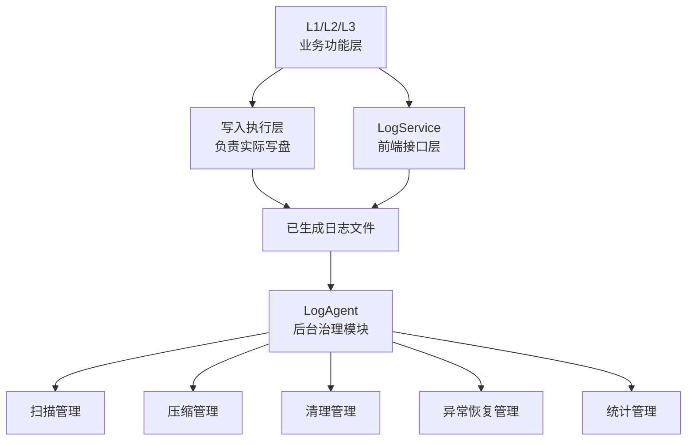

# LogAgent 模块详细设计

## 1. 修订记录

| 版本 | 日期 | 作者 | 说明 |
| --- | --- | --- | --- |
| v0.1 | 2026-06-19 | Codex | 新建 `LogAgent` 模块详细设计 |
| v0.2 | 2026-06-20 | Codex | 按当前职责边界重整后台治理设计 |
| v0.3 | 2026-06-20 | Codex | 明确未封口恢复前移到 service，补充同步收尾治理语义 |

## 2. 模块定位

`LogAgent` 是日志系统中的后台治理模块。

它不负责日志内容生成，也不负责前台写入控制，而是负责对已经生成的日志文件做异步治理，包括扫描、压缩、清理、有限的异常恢复与统计。

职责边界上：

1. 写入执行层负责日志内容写入与具体文件操作
2. `L2` 负责原始数据、索引文件与会话元数据生成
3. `LogService` 负责前端接口语义、命名规则、封口规则、查询与打包交付能力
4. `LogAgent` 负责后台扫描、压缩、清理、统计治理，并对前台未及时恢复的未封口文件提供兜底恢复能力

## 3. 设计目标

1. 统一管理日志文件的后台治理动作
2. 提供扫描、压缩、清理、异常恢复与统计能力
3. 与前台控制链路解耦，避免治理动作阻塞写入
4. 为 `L1/L2/L3` 提供统一可复用的后治理能力
5. 保证文件治理规则与统一命名语义一致

## 4. 总体设计

### 4.1 模块职责

`LogAgent` 负责以下几类能力：

1. 扫描管理
2. 压缩管理
3. 清理管理
4. 异常检测与兜底恢复管理
5. 统计管理

### 4.2 模块关系

接口约束：

1. `LogAgent` 接管的是已生成文件，而不是活跃写入句柄
2. 前台命名、封口、查询、打包接口由 `LogService` 提供
3. 后台压缩、清理、恢复、统计由 `LogAgent` 提供
4. 两者通过统一命名规则和目录约定协同，而不是通过共享写入运行态协同

### 4.3 调度模型

`LogAgent` 采用后台线程或等价后台执行单元持续执行治理动作。

调度原则如下：

1. 启动阶段优先执行扫描与异常恢复
2. 运行阶段周期执行扫描、压缩与清理
3. 紧急治理动作可被前台显式触发
4. 停止阶段应具备同步收尾治理能力
5. 后台治理不应阻塞前台写入链路

### 4.4 文件识别语义

`LogAgent` 依赖统一的时间命名规则识别文件生命周期状态。

识别语义如下：

1. 文件名由开始时间、结束时间和后缀组成
2. 仅包含开始时间的文件视为未正常封口文件
3. 同时具备开始时间和结束时间的文件视为已完成封口文件
4. 压缩后的文件在原有命名规则基础上附加压缩后缀
5. 会话元数据文件也遵循统一时间命名规则，但不进入压缩对象集合

## 5. 模块划分

### 5.1 扫描管理

职责：

1. 扫描日志根目录
2. 识别已封口文件、压缩文件与异常文件
3. 为压缩、清理、恢复与统计提供统一输入
4. 输出统一文件清单与状态视图

### 5.2 压缩管理

职责：

1. 选择已封口历史文件作为压缩候选
2. 后台异步执行压缩
3. 压缩失败时保留原文件并记录失败状态
4. 为清理和统计提供压缩产物

说明：

1. 会话元数据文件不作为压缩对象
2. 是否在压缩后删除原始文件由统一策略控制

### 5.3 清理管理

职责：

1. 删除超出保留窗口的历史文件
2. 支持自动清理与手动清理
3. 支持 `dry-run`
4. 避免误删异常文件和未完成治理文件

### 5.4 异常检测与恢复管理

职责：

1. 检测未正常封口文件
2. 检测命名异常文件和治理失败文件
3. 在前台未完成恢复时执行兜底恢复、标记或补救动作
4. 为统计与问题分析提供异常会话信息

### 5.5 统计管理

职责：

1. 统计文件数量与容量信息
2. 统计已封口、已压缩和异常文件状态
3. 统计异常恢复结果
4. 为治理策略调整提供输入

## 6. 模块设计

### 6.1 扫描管理设计

设计流程：

1. 从根目录开始递归扫描
2. 过滤目录和非目标文件
3. 解析文件名时间语义和文件状态
4. 识别异常命名、未封口文件和治理失败文件
5. 输出统一文件集合和异常集合

设计原则：

1. 扫描阶段只做识别与分类，不直接修改文件
2. 扫描结果应统一供压缩、清理、恢复与统计复用
3. 扫描结果应可复查、可重复计算

### 6.2 压缩管理设计

设计流程：

1. 从扫描结果中选取已封口历史文件
2. 过滤不应压缩的文件类型
3. 按策略加入压缩候选集合
4. 执行压缩并更新结果状态
5. 压缩失败时记录失败次数与失败状态

设计要点：

1. 压缩是异步治理动作
2. 压缩不能阻塞前台写入
3. 压缩失败不能影响其余治理动作
4. 压缩结果需要能被清理与统计识别
5. 会话元数据文件不参与压缩

### 6.3 清理管理设计

自动清理流程：

1. 基于扫描结果选择历史文件
2. 依据保留窗口判断是否过期
3. 跳过异常文件和受保护文件
4. 删除超时历史文件

手动清理流程：

1. 接收清理条件
2. 支持 `dry-run`
3. 输出候选清单
4. 在确认后执行删除动作

设计要点：

1. 清理动作不能误删未封口文件
2. 清理动作应支持审计与演练
3. 清理动作应与异常恢复结果联动

### 6.4 异常检测与恢复设计

设计目标：

1. 在系统重启后识别上次未正常结束的文件
2. 区分正常封口文件与异常残留文件
3. 尽量补齐文件生命周期信息
4. 为后续清理、统计与问题分析提供异常标记

设计流程：

1. 启动时优先扫描日志根目录
2. 识别仅包含开始时间的未封口文件
3. 当前台未恢复时，尝试基于文件内容恢复结束时间语义
4. 无法恢复时优先保留现场并打异常标记
5. 生成异常会话记录，供统计与工具层使用

设计原则：

1. 恢复动作不能破坏原始日志内容
2. 无法自动修复时，应优先保留现场
3. 异常恢复应在启动阶段优先执行
4. 对于 `L2` 这类需要在新一轮写入前完成收尾的日志层，启动前封口恢复优先由 `LogService` 接口和日志层前台流程完成
5. `LogAgent` 的未封口恢复属于兜底能力，不替代前台启动恢复接口
6. 恢复结果应可被统计和复核

### 6.5 统计管理设计

设计方式：

1. 基于扫描结果统计文件维度信息
2. 基于异常会话统计治理维度信息
3. 为容量治理和策略调整提供输入

统计内容包括：

1. 文件总数
2. 已封口文件数
3. 已压缩文件数
4. 异常文件数
5. 总容量
6. 异常恢复结果

### 6.6 后台线程与调度设计

`LogAgent` 采用常驻后台执行机制持续完成治理动作。

设计内容：

1. 后台执行单元启动与停止机制
2. 周期扫描间隔配置
3. 压缩、清理、恢复任务的调度顺序
4. 停止阶段的收尾治理策略

启动与停止规则：

1. `LogAgent` 由系统启动流程或主控模块显式启动
2. 启动后优先执行一次扫描与恢复
3. 停止前可执行一次同步收尾治理，按扫描、恢复、压缩顺序完成本进程文件收尾

设计原则：

1. 后台治理不直接阻塞前台写入
2. 治理任务应串行或受控并行，避免相互抢占
3. 调度状态应可观测、可复核、可恢复
4. `LogAgent` 接管的是封口后或异常残留后的文件治理，不接管前台写入控制

## 7. 数据对象设计

### 7.1 文件状态对象

文件状态对象用于表达一次扫描得到的单个文件视图，建议包含以下信息：

1. 文件路径
2. 文件类型
3. 文件状态
4. 开始时间
5. 结束时间
6. 文件大小

说明：

1. 文件状态至少应区分已封口、已压缩和异常三类
2. 未正常封口文件应纳入异常恢复流程

### 7.2 文件治理策略对象

文件治理策略对象用于描述后台治理行为约束，建议包含以下信息：

1. 保留窗口
2. 扫描周期
3. 清理周期
4. 压缩重试上限
5. 压缩后是否删除原始文件

### 7.3 异常会话对象

异常会话对象用于表达恢复或治理阶段识别出的异常上下文，建议包含以下信息：

1. 异常文件或异常会话路径
2. 会话标识
3. 异常类型
4. 检测原因
5. 检测时间
6. 是否已完成恢复

### 7.4 调度状态对象

调度状态对象用于表达后台治理执行状态，建议包含以下信息：

1. 后台执行单元是否运行
2. 最近扫描时间
3. 最近清理时间
4. 最近恢复时间
5. 待压缩任务数量
6. 是否处于退出收尾阶段

### 7.5 运行时状态对象

运行时状态对象用于对外提供当前治理视图，建议包含以下信息：

1. 管理根目录
2. 文件治理策略
3. 当前已扫描文件集合
4. 当前异常会话集合
5. 调度状态
6. 统计信息

## 8. 设计边界说明

`LogAgent` 是后台治理模块，不是前台控制模块，也不是日志内容写入模块。

边界说明如下：

1. 写入执行层负责日志内容写入与具体文件操作
2. `L2` 负责原始数据、索引文件和会话元数据生成
3. `LogService` 负责命名规则、封口规则、查询、打包、导出与本地交付接口
4. `LogAgent` 负责扫描、压缩、清理、异常恢复与统计
5. `LogAgent` 的治理对象是已经生成的文件集合，而不是前台写入运行态

## 9. 结论

`LogAgent` 的本质是日志系统中的统一后台治理模块。

它需要统一承担以下能力：

1. 文件扫描
2. 异步压缩
3. 清理治理
4. 异常检测与恢复
5. 统计分析

通过将这些能力收口到 `LogAgent`，并将命名、封口、查询、打包与交付动作收口到 `LogService`，日志系统可以形成更清晰的前台控制与后台治理分层。
