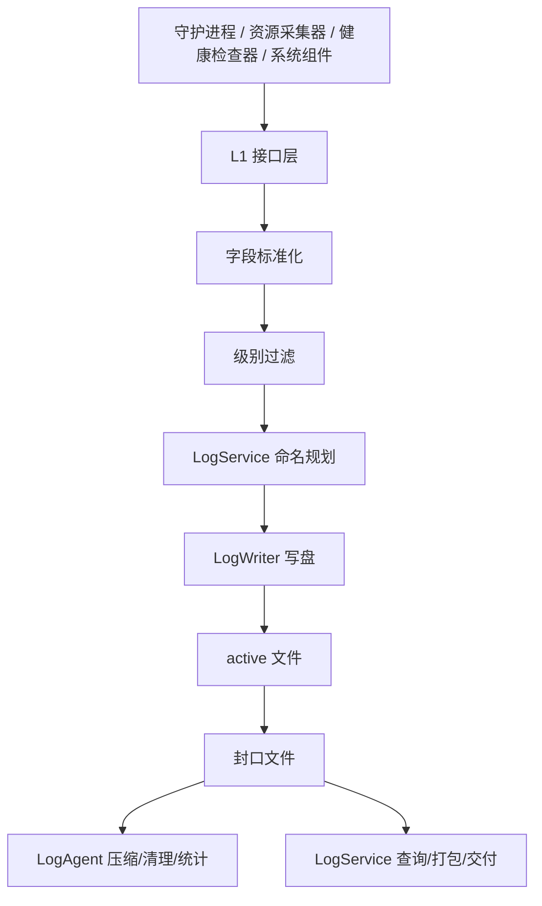

# L1 系统级监控日志详细设计

## 1. 修订记录

| 版本 | 日期 | 作者 | 说明 |
| --- | --- | --- | --- |
| v0.1 | 2026-06-21 | Codex | 新建 `L1` 系统级监控日志详细设计 |

## 2. 背景与目标

### 2.1 背景

`L1` 用于承载系统级日志，核心职责是监控系统本身，而不是承载业务语义或原始数据。

它和 `L2`、`L3` 的定位区别如下：

1. `L1` 关注系统健康、资源水位、进程状态、组件存活和故障告警
2. `L2` 关注原始数据留存、时间段归档和离线复盘
3. `L3` 关注业务模块语义、流程行为和业务调试

`L1` 的核心价值是为在线监控、首诊排障、运行保障和系统审计提供一层稳定、轻量、可持续运行的系统监控日志能力。

### 2.2 实现目标

1. 提供统一的系统监控日志接入层
2. 支持健康、资源、进程、心跳、告警等内容稳定落盘
3. 复用 `LogService` 的命名、封口、查询与打包语义
4. 复用 `LogAgent` 的压缩、清理和后台治理能力
5. 复用 `LogWriter` 的安全高效写盘能力
6. 为监控平台、CLI、问题诊断和交付工具提供稳定输入

## 3. 需求概述

### 3.1 功能需求

1. 支持统一初始化，指定监控日志输出目录和基础写入策略
2. 支持 `TRACE/DEBUG/INFO/WARN/ERROR/CRITICAL` 六级日志
3. 支持文本日志和结构化文本日志两种输出形态
4. 支持记录组件、线程、文件、行号、函数等基础上下文
5. 支持运行期动态调级
6. 支持按大小分段和按统一规则封口
7. 支持正常退出收口
8. 支持启动前未封口文件恢复
9. 支持查询、打包、导出和本地交付

### 3.2 非功能需求

1. 写入逻辑不能明显阻塞监控采集和主业务线程
2. 日志文件需可持续长时间运行
3. 异常退出后文件需可恢复和可读取
4. 目录与文件语义要稳定，便于工具解析
5. 运行期开销应可控，支持同步或异步模式切换

## 4. 总体设计

### 4.1 模块定位

`L1` 是面向系统监控与健康观测的文本日志层。

职责边界如下：

1. `L1` 负责定义系统监控日志字段、接口语义和调用方式
2. `LogWriter` 负责把文本内容安全高效写入指定文件
3. `LogService` 负责命名、封口、查询、打包和交付接口
4. `LogAgent` 负责后台压缩、清理、统计和兜底治理

### 4.2 设计原则

1. `L1` 只负责系统级监控日志，不承担原始数据录制
2. `L1` 不自带独立压缩或清理逻辑，统一复用公共层
3. `L1` 的调用方式应尽量简单，接近普通日志宏
4. `L1` 输出要适合人读，同时保留监控工具可解析性
5. `L1` 文件生命周期语义必须与 `L2/L3` 保持一致

### 4.3 总体架构图



## 5. 模块划分

### 5.1 接口层

职责：

1. 对外暴露 `Init`、`SetLevel`、`Flush`、`Shutdown`
2. 对外暴露统一日志写入宏
3. 接收组件名、级别和日志内容
4. 组织标准化记录并下发到底层写入层

### 5.2 字段标准化层

职责：

1. 补齐监控事件时间
2. 补齐组件名和级别名
3. 补齐线程号、源码位置等可选字段
4. 统一文本或结构化文本格式

### 5.3 生命周期管理层

职责：

1. 初始化时申请当前 active 文件
2. 正常退出时执行收口
3. 启动前处理遗留 active 文件
4. 在分段时切换到新 active 文件

### 5.4 工具交互层

职责：

1. 向 `LogService` 发起查询
2. 向 `LogService` 发起时间段打包
3. 向 `LogService` 发起导出和本地交付
4. 不直接操作底层压缩和清理细节

## 6. 模块设计

### 6.1 日志内容模型

`L1` 单条日志建议至少包含以下字段：

1. `timestamp_us`：监控事件时间
2. `level`：日志级别
3. `module`：来源组件
4. `message`：文本内容
5. `thread_id`：线程标识
6. `file`：源码文件，可选
7. `line`：源码行号，可选
8. `func`：函数名，可选

可选扩展字段建议包括：

1. `event`：监控事件名
2. `metric_name`：指标名
3. `metric_value`：指标值
4. `threshold`：阈值
5. `host`：主机名或设备名
6. `process`：进程名或服务名
7. `error_code`：错误码
8. `context`：附加上下文

### 6.2 对外接口设计

建议对外保留最小接口集合：

1. `Init(options)`
2. `SetLevel(level)`
3. `SetModuleLevel(module, level)`
4. `Trace/Debug/Info/Warn/Error/Critical`
5. `Flush()`
6. `Shutdown()`

典型调用方式如下：

```cpp
L1::Init(options);
L1_INFO("HEALTH", "watchdog heartbeat ok");
L1_WARN("RESOURCE", "disk usage exceeds threshold");
L1_ERROR("PROCESS", "planner process exited unexpectedly");
L1::Shutdown();
```

接口约束：

1. 调用方不直接感知文件命名细节
2. 调用方不直接操作压缩和清理
3. 级别过滤在写入前完成
4. 运行中切级后立即生效

### 6.3 文件组织设计

`L1` 建议采用单目录或少量固定子目录组织监控日志，不按组件无限拆目录。

建议目录语义如下：

1. `system/`：默认系统级监控日志目录
2. `system/archive/`：导出或打包产物目录，可选

文件命名规则复用 `LogService`：

1. active 文件：`<start_time>-.log`
2. sealed 文件：`<start_time>-<end_time>.log`
3. 压缩文件：`<start_time>-<end_time>.log.gz`

说明：

1. `start_time` 和 `end_time` 统一采用 `yymmdd_hhmmss`
2. 时间格式由 `LogService` 统一管理，`L1` 不自行定义另一套格式

### 6.4 分段与收口设计

分段策略建议如下：

1. 以单文件大小为主触发分段
2. 允许在进程正常关闭时对当前 active 文件立即收口
3. 启动时优先检查并恢复上次遗留的 active 文件
4. 分段切换期间不允许丢失关键监控日志

实现语义：

1. `L1` 根据当前 active 文件持续写入
2. 达到阈值后通过 `LogService` 生成新的 active 规划
3. 原 active 文件先封口，再切到新文件
4. 已封口文件是否立即压缩由 `LogAgent` 决定

### 6.5 运行时治理设计

`L1` 自身不持有后台治理逻辑，只暴露监控日志治理可协作信息。

协作语义如下：

1. `L1` 负责产出命名规范正确的 active 和 sealed 文件
2. `LogAgent` 负责扫描 sealed 文件并异步压缩
3. `LogAgent` 负责按容量和保留期清理历史文件
4. `LogService` 负责对外提供时间段查询和打包接口

### 6.6 查询与打包设计

`L1` 的查询和打包能力依赖 `LogService`，查询维度建议包括：

1. 时间范围
2. 日志级别
3. 组件名
4. 关键字

打包语义建议包括：

1. 支持 `start + end`
2. 支持 `start + duration`
3. 命中的 sealed 文件若尚未压缩，先压缩再归档
4. 打包输出文件名使用统一时区和统一时间格式

### 6.7 异常恢复设计

异常恢复分为两类：

1. 启动前恢复
2. 后台兜底恢复

处理原则：

1. 启动前恢复优先由 `L1 + LogService` 前台完成
2. 若前台未恢复，`LogAgent` 可在后台做兜底检测
3. 恢复动作只补齐生命周期，不修改原始日志内容语义
4. 无法安全恢复时优先保留现场并记录异常

## 7. 配置建议

`L1` 建议支持以下配置项：

1. `root_dir`
2. `file_name` 或文件后缀
3. `default_level`
4. `module_levels`
5. `max_file_size_bytes`
6. `max_files`
7. `async_mode`
8. `async_queue_size`
9. `flush_interval_seconds`
10. `enable_console_output`
11. `enable_source_location`
12. `recover_on_init`
13. `recover_on_shutdown`
14. `enable_runtime_agent`

## 8. 与 L2/L3 的关系

1. `L1` 和 `L3` 都属于文本日志层，底层都可复用 `LogWriter`
2. `L1` 更偏系统健康、资源、进程和监控告警
3. `L3` 更偏业务模块语义和业务调试
4. `L2` 是原始数据层，不与 `L1/L3` 混用同一记录语义
5. 三层统一复用 `LogService` 和 `LogAgent`

## 9. 测试建议

`L1` 后续建议至少覆盖以下测试项：

1. 基本监控日志写入
2. 全局级别过滤
3. 组件级别覆盖
4. 高频心跳与资源采样写入
5. 正常退出收口
6. 启动前 active 恢复
7. 运行中 agent 压缩 sealed 文件
8. 时间段查询与打包
9. 磁盘、CPU、内存阈值告警场景
10. 进程异常退出与恢复场景
