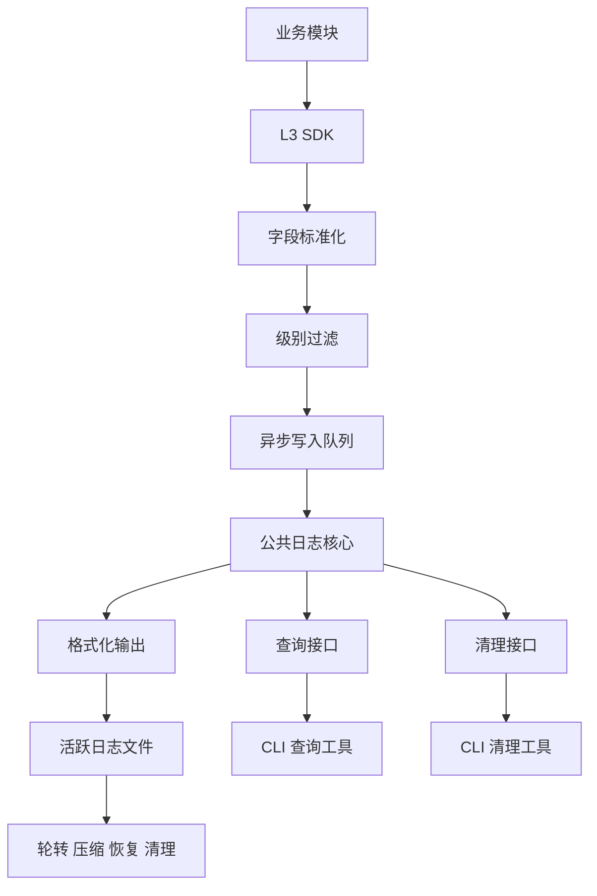

# L3 业务日志详细设计

## 1. 修订记录

| 版本 | 日期 | 作者 | 说明 |
| --- | --- | --- | --- |
| v0.1 | 2026-06-19 | Codex | 基于 `log_l3.md` 形成 L3 独立详细设计 |

## 2. 背景与目标

### 2.1 背景

`L3` 是面向业务模块分发的对外日志 SDK，主要服务平台层、应用层和算法层。整体可基于 `spdlog` 进行封装和改造，同时提供 `C++` 与 `Python` 两种语言接口。

`L3` 关注的是：

1. 业务当前在执行什么
2. 业务状态为什么发生变化
3. 哪个任务、流程或策略导致了当前行为
4. 业务异常如何影响最终结果

因此，`L3` 不只是一个写文件接口，而是一套统一的业务日志接入规范、字段规范和运行时控制能力。

### 2.2 需求来源

结合 [log_l3.md](/Users/wanghusen/Desktop/code/log/log/doc/log_l3.md) 的需求，`L3` 的主要需求来源如下：

1. 当前不同业务模块日志格式不统一，后续查询和分析成本高
2. 业务线程需要低开销记录日志，不能因写盘阻塞控制逻辑
3. 业务日志需要支持动态调级和统一清理
4. 业务日志需要通过统一 SDK 分发给各个子模块使用
5. 业务日志需要支持统一内容格式，便于后续查询和分析
6. 不同业务模块技术栈不一致，需要同时支持 `C++` 和 `Python` 接口

### 2.3 实现目标

`L3` 的实现目标如下：

1. 提供统一、易接入的业务日志 SDK
2. 统一业务日志字段格式、目录组织和对外调用形态
3. 支持非阻塞写入和动态调级
4. 支持业务日志轮转、压缩、异常恢复和自动清理
5. 支持模块级查询、级别筛选和时间范围检索
6. 为后续链路分析工具保留必要上下文，但不将 `trace_id` 作为日志标准字段
7. 为平台层、应用层、算法层提供统一接入方式
8. 提供语义一致的 `C++` 与 `Python` SDK 接口

## 3. 需求概述

### 3.1 功能需求

#### 3.1.1 公共层补充需求

为支持 `L3` SDK，对公共基础层补充如下能力：

1. 支持统一初始化与配置加载接口
2. 支持统一日志字段校验与标准化
3. 支持异步队列、批量写入和定时 flush
4. 支持运行时动态调级
5. 支持统一轮转、压缩、过期清理和异常恢复接口
6. 支持磁盘水位检测，并根据剩余空间执行降级策略
7. 支持查询接口和清理接口，由 CLI 或运维工具调用
8. 支持日志系统配置的统一加载与生效
9. 支持日志系统自身运行状态监控

#### 3.1.2 L3 功能需求

1. 支持平台层、应用层、算法层统一接入同一套 SDK
2. 支持业务日志写入
3. 支持 `DEBUG/INFO/WARN/ERROR/CRITICAL` 五级日志
4. 支持统一的 `payload` 日志内容输入
5. 支持运行时修改指定模块日志级别且立即生效
6. 支持按模块、级别、时间范围查询业务日志
7. 支持系统磁盘空间不足时自动降级写入策略
8. 支持平台层、应用层、算法层通过统一 SDK 接入
9. 支持 `C++` 和 `Python` 两套对外接口，并保持字段语义一致

### 3.2 非功能需求

1. SDK 写入过程不阻塞业务线程
2. 正常运行时 CPU 与内存占用可控
3. 日志进程异常退出时不能导致文件不可读
4. 日志文件损坏时应支持自动隔离和重新建文件

## 4. 总体设计

### 4.1 模块定位

`L3` 的模块定位如下：

1. 公共基础层提供日志核心、异步写入、文件生命周期、查询与清理接口
2. `L3` 提供面向业务模块的 SDK、字段规范和业务语义输出能力
3. CLI 或运维工具基于公共层接口完成查询、清理和统计

### 4.2 L3 设计原则

`L3` 设计遵循以下原则：

1. 以 SDK 为中心，而不是以文件格式为中心
2. 业务日志只表达业务语义
3. 对外统一采用 `(module, payload)` 形式，由 SDK 完成标准化落盘
4. 日志中不内置 `trace_id` 标准字段，链路追踪能力交由上层协议或独立工具体系处理
5. 公共层负责通用能力，`L3` 只负责业务层表达和接入约束
6. SDK 接口风格应尽量简单直接，与普通 `print` 保持一致
7. `C++` 与 `Python` 接口共享同一套字段定义、级别定义和行为约束

### 4.3 总体架构图



## 5. 模块划分

### 5.1 公共基础层补充

职责：

1. 提供统一 SDK 初始化入口
2. 提供日志记录对象标准化能力
3. 提供异步队列、批量消费和定时刷新
4. 提供动态调级接口
5. 提供轮转、压缩、清理、恢复和磁盘水位保护
6. 提供查询接口和清理接口供工具层调用
7. 提供配置加载与运行状态监控能力

### 5.2 L3 SDK 层

职责：

1. 对外暴露初始化、写日志、调级、刷新、关闭等最小接口集合
2. 约束字段格式、级别使用规范和 `payload` 使用方式
3. 将业务日志转换为公共层可处理的标准记录对象
4. 对业务模块屏蔽底层文件写入和生命周期细节
5. 提供 `C++` 与 `Python` 两套语言绑定

### 5.3 语言绑定层

职责：

1. `C++` 接口直接面向本体核心模块
2. `Python` 接口面向脚本、工具和上层业务逻辑
3. 两套接口复用同一日志核心，不允许各自实现一套独立日志逻辑
4. 两套接口的字段定义、级别语义和配置行为保持一致

实现原则：

1. 内部只保留一套 `C++` 日志核心实现
2. `C++` 业务接口直接调用该核心
3. `Python` 接口通过绑定层调用同一套 `C++` 核心
4. 不采用两套独立日志程序或两套独立日志实现

### 5.4 工具调用层

职责：

1. 调用公共层查询接口完成日志搜索和统计
2. 调用公共层清理接口执行手动清理
3. 提供命令行入口，但不承载日志核心逻辑

## 6. 模块设计

### 6.1 公共基础层补充设计

#### 6.1.1 初始化配置

公共层需要提供统一初始化能力，至少包含：

1. 日志根目录或输出路径
2. 默认日志级别
3. 是否开启调试位置信息
4. 是否输出到控制台
5. 基础静态字段配置

#### 6.1.2 异步写入与丢弃策略

公共层建议采用异步队列模型：

1. SDK 线程仅负责构造记录并投递队列
2. 后台线程负责批量格式化和落盘
3. 队列满时，`WARN` 以下日志允许按策略丢弃
4. `ERROR` 与 `CRITICAL` 不允许因普通拥塞被静默丢弃
5. 定期输出队列积压和丢弃统计

#### 6.1.3 动态调级

公共层需要提供运行时动态调级接口：

1. 支持按模块修改日志级别
2. 支持全局默认级别修改
3. 修改后立即生效
4. 变更动作本身需要记录系统日志

#### 6.1.4 文件生命周期与磁盘保护

公共层需要统一负责：

1. 活跃文件创建与写入
2. 按文件大小轮转
3. 关闭文件后压缩归档
4. 新文件开头保留上一文件尾部的少量日志，默认保留最近 `100` 条
5. 按保留时间和总容量执行清理
6. 系统每隔固定周期执行清理检查，默认 `10` 分钟
7. 根据磁盘剩余空间执行写入降级
8. 当磁盘空间低于告警阈值时记录系统告警
9. 当磁盘空间低于紧急阈值时，仅保留高优先级日志
10. 异常退出后恢复活跃文件
11. 文件损坏后隔离坏文件并重新建新文件

建议磁盘策略：

1. 默认总容量上限 `2GB`
2. 默认保留时间 `2` 天
3. 磁盘低于 `500MB` 时进入告警或降级状态
4. 磁盘低于 `100MB` 时优先删除最旧文件，直到恢复安全水位

#### 6.1.5 查询与清理接口

公共层对工具层提供：

1. 按模块查询
2. 按日志级别查询
3. 按时间范围查询
4. 查询最新若干条热日志
5. 查询文件容量和日志条数统计
6. 手动清理接口

说明：

1. 查询接口按模块、级别、时间范围和行数工作
2. `trace_id` 查询不作为 `L3` 标准查询能力的一部分

#### 6.1.6 配置管理

公共层建议通过 `yaml` 统一管理日志系统配置，至少包含：

1. 日志根目录
2. 日志系统自身日志级别
3. 单文件最大大小
4. 文件保留时间
5. 压缩阈值
6. 磁盘告警阈值
7. 磁盘紧急阈值
8. 批量写入大小
9. 定时写入间隔
10. 日志队列默认大小

#### 6.1.7 系统自监控

公共层需要具备日志系统自身监控能力：

1. 队列积压超过阈值时输出 `WARN`
2. 定期输出时间窗口内的丢弃日志统计
3. 日志系统自身日志按普通日志相同策略轮转和清理
4. 关键故障场景需要支持自动拉起或由守护进程拉起

### 6.2 L3 SDK 设计

#### 6.2.1 模块目标

`L3` 目标是为业务模块提供统一、稳定、低接入成本的业务日志 SDK，并同时覆盖 `C++` 与 `Python` 接入场景。

#### 6.2.2 典型使用方

1. 导航任务编排模块
2. 状态机模块
3. 调度管理模块
4. 场景识别模块
5. 上层应用业务模块

#### 6.2.3 对外能力

`L3` SDK 对业务模块建议暴露以下最终接口清单：

1. `Init(level, path)`
2. `LOG_TRACE(module, payload)`
3. `LOG_DEBUG(module, payload)`
4. `LOG_INFO(module, payload)`
5. `LOG_WARN(module, payload)`
6. `LOG_ERROR(module, payload)`
7. `LOG_CRITICAL(module, payload)`
8. `Flush()`
9. `Shutdown()`

接口要求：

1. `C++` 与 `Python` 接口应支持相同的核心能力
2. 两套接口的参数命名和字段语义应尽量一致
3. `C++` 侧对外形态应与 `naviai_log.hpp` 保持一致

#### 6.2.4 对外调用方式

`L3` 对外调用方式建议分为三类：

1. 初始化与关闭
2. 级别控制
3. 日志写入

`C++` 侧建议调用方式如下：

```cpp
L3::Init(LogLevel::Info, "/var/log/robot/app");

LOG_TRACE(LoggerModule::NAVIGATION, "trace message");
LOG_DEBUG(LoggerModule::NAVIGATION, "planner tick");
LOG_INFO(LoggerModule::NAVIGATION, "task started");
LOG_WARN(LoggerModule::NAVIGATION, "fallback triggered");
LOG_ERROR(LoggerModule::NAVIGATION, "planner failed");
LOG_CRITICAL(LoggerModule::NAVIGATION, "planner exit");

L3::Flush();
L3::Shutdown();
```

推荐主调用方式直接使用宏，风格上与 `naviai_log.hpp` 保持一致：

```cpp
LOG_DEBUG(LoggerModule::NAVIGATION, "planner tick");
LOG_INFO(LoggerModule::NAVIGATION, "task started");
LOG_WARN(LoggerModule::NAVIGATION, "fallback triggered");
LOG_ERROR(LoggerModule::NAVIGATION, "planner failed");
LOG_CRITICAL(LoggerModule::NAVIGATION, "planner exit");
```

`Python` 侧建议调用方式如下：

```python
from robot_log import l3

l3.init("INFO", "/var/log/robot/app")

l3.trace("NAVIGATION", "trace message")
l3.debug("NAVIGATION", "planner tick")
l3.info("NAVIGATION", "task started")
l3.warn("NAVIGATION", "fallback triggered")
l3.error("NAVIGATION", "planner failed")
l3.critical("NAVIGATION", "planner exit")

l3.flush()
l3.shutdown()
```

最终推荐的最小对外接口如下：

```text
Init(level, path)
LOG_TRACE(module, payload)
LOG_DEBUG(module, payload)
LOG_INFO(module, payload)
LOG_WARN(module, payload)
LOG_ERROR(module, payload)
LOG_CRITICAL(module, payload)
Flush()
Shutdown()
```

约束如下：

1. 对外统一采用 `(module, payload)` 形式
2. `C++` 与 `Python` 只是调用形式不同，落盘字段必须一致
3. `Flush` 和 `Shutdown` 属于进程级操作，不属于单模块操作
4. `Init` 参数顺序与 `naviai_log.hpp` 保持一致，即先级别后路径
5. `C++` 侧模块参数使用显式 `LoggerModule` 枚举
5. `Init` 时必须显式传入日志根目录或输出路径

#### 6.2.5 字段规范

单条 `L3` 业务日志建议包含以下标准字段：

1. `version`
2. `timestamp_us`
3. `robot_sn`
4. `layer`
5. `module`
6. `level`
7. `payload`

可选字段：

1. `receive_timestamp_us`
2. `file`
3. `line`
4. `func`

说明：

1. `payload` 表示业务侧直接传入的日志内容
2. `module` 由显式模块参数提供，`C++` 侧优先使用 `LoggerModule` 枚举
3. `trace_id` 不作为标准日志字段写入
4. 如果上层系统确实需要链路标识，可在 `payload` 内按业务约定表达，但不纳入统一标准字段

#### 6.2.6 日志级别规范

`L3` 沿用五级定义：

1. `DEBUG`：开发调试和细节执行路径
2. `INFO`：关键业务里程碑和状态切换
3. `WARN`：业务可继续但存在风险或降级
4. `ERROR`：当前任务失败或关键业务能力异常
5. `CRITICAL`：模块无法继续运行

#### 6.2.7 输出特点

`L3` 日志重点回答以下问题：

1. 当前执行的是哪一个业务流程
2. 当前流程进入了哪个状态
3. 为什么发生状态迁移
4. 哪个规则、条件或异常影响了最终行为

### 6.3 语言接口设计要求

#### 6.3.1 C++ 接口要求

1. 提供头文件和链接库形式的直接接入方式
2. 主调用方式以 `LOG_TRACE/LOG_DEBUG/LOG_INFO/LOG_WARN/LOG_ERROR/LOG_CRITICAL` 宏为主
3. 支持在 `DEBUG` 级别自动补充 `file/line/func`
4. 宏调用方式应与 `naviai_log.hpp` 保持一致
5. 模块参数应使用显式枚举，不依赖源码文件内的默认模块宏

#### 6.3.2 Python 接口要求

1. 提供 `import` 即可使用的模块接口
2. 接口形态应与 `C++` 侧保持同构，即显式传入模块和日志内容
3. 支持运行时调整模块级别和主动刷新

#### 6.3.3 一致性要求

1. `C++` 与 `Python` 写出的日志字段必须一致
2. 相同级别语义、相同模块输入在两种语言下应表现一致
3. 两种语言生成的日志文件目录、命名和清理行为必须一致

#### 6.3.4 双接口实现方式

`L3` 的双语言接口建议采用“一套核心、两层出口”的实现方式：

1. 底层日志核心使用 `C++` 实现
2. `C++` 对外接口直接暴露头文件、枚举和日志宏
3. `Python` 对外接口通过绑定层调用同一套 `C++` 核心能力
4. 轮转、压缩、清理、异步队列、文件格式等逻辑只允许在核心层实现一次

建议结构如下：

```text
L3 Core (C++)
├── LogManager
├── LoggerModule
├── 异步队列与线程池
├── 文件轮转 / 压缩 / 清理
├── C++ 宏接口
└── Python 绑定层
```

实现约束：

1. 不允许 `Python` 再单独实现一套日志落盘逻辑
2. 不允许 `C++` 与 `Python` 各自维护不同的文件格式
3. 绑定层只负责参数转换，不负责改变日志语义
4. `Python` 侧模块名、级别名应与 `C++` 侧保持一致

## 7. 数据结构设计

### 7.1 公共层补充数据结构

#### 7.1.1 标准日志记录

```cpp
struct LogRecord {
    std::string version;                          // 格式版本
    int64_t timestamp_us;                         // 业务事件时间
    int64_t receive_timestamp_us;                 // 接收时间，可选
    std::string robot_sn;                         // 机器人序列号
    std::string layer;                            // 所属层级
    std::string module;                           // 模块名，由枚举或等价标识映射
    LogLevel level;                               // 日志级别
    std::string payload;                          // 业务传入的日志内容
    std::string file;                             // 源文件名，可选
    int line;                                     // 行号，可选
    std::string func;                             // 函数名，可选
};
```

### 7.2 L3 SDK 数据结构

#### 7.2.1 SDK 配置

```cpp
struct L3SdkOptions {
    std::string root_dir;               // 日志根目录或输出路径
    std::string robot_sn;               // 机器人序列号
    std::string module;                 // 当前进程默认模块名
    std::string layer;                  // 当前进程默认层级
    LogLevel sdk_level;                 // Init 时传入的默认日志级别
    size_t queue_size;                  // 日志队列容量
    size_t batch_size;                  // 单次批量写入条数
    int flush_interval_ms;              // 定时刷新周期
    size_t max_file_size_bytes;         // 单文件轮转阈值
    int retention_days;                 // 文件保留天数
    size_t total_size_limit_bytes;      // 总容量上限
    size_t compress_threshold_bytes;    // 压缩阈值
    size_t disk_warn_threshold_bytes;   // 磁盘告警阈值
    size_t disk_emergency_threshold_bytes; // 磁盘紧急阈值
    bool enable_source_location;        // 是否输出源码位置信息
    bool console_output;                // 是否同时输出到控制台
};
```

#### 7.2.2 写日志参数

```cpp
struct L3LogInput {
    std::string module;                           // 模块名
    LogLevel level;                               // 日志级别
    std::string payload;                          // 业务侧传入日志内容
    int64_t timestamp_us;                         // 业务事件时间，可为空
};
```

说明：

1. `C++` 与 `Python` 接口都应映射到该统一输入语义
2. `Python` 接口可以在语言层做更友好的参数包装，但最终落盘字段保持一致

#### 7.2.3 Python 接口参数映射

```python
class L3LogKwargs(TypedDict, total=False):
    module: str
    level: str
    payload: str
    timestamp_us: int
```

说明：

1. `Python` 层可以使用关键字参数提升易用性
2. 内部仍需转换为统一的 `L3LogInput`
3. `module` 建议与 `C++` 侧 `LoggerModule` 枚举名称保持一致

## 8. 文件与目录设计

### 8.1 目录结构

建议目录结构如下：

```text
/var/log/robot/
├── <module_a>/
│   ├── <module_a>.log.<date>
│   ├── <module_a>.log.<date>_1.gz
│   └── ...
├── <module_b>/
│   └── ...
└── system/
    ├── logd.log
    └── time_sync.log
```

### 8.2 文件命名规则

命名建议如下：

1. 活跃文件：`<module>.log.<YYYYMMDD>`
2. 轮转文件：`<module>.log.<YYYYMMDD>_<index>.gz`
3. 系统自身日志单独存放于 `system/`

### 8.3 加密约束

如需满足安全要求，可在公共层增加对称加密能力，但加密逻辑应统一放在公共层，不放在 `L3 SDK` 业务接口层中单独处理。

## 9. 后续建议

1. 后续补充 `L3` SDK API 级别的接口示例
2. 后续补充 `payload` 内容书写规范
3. 后续明确链路分析工具与日志字段之间的边界
4. 后续补充 `C++` 与 `Python` 双接口的示例代码

## 10. 结论

`L3` 是面向业务模块分发的统一日志 SDK。

其核心边界如下：

1. 公共层负责异步写入、轮转、压缩、清理、恢复、查询接口
2. `L3` 负责业务日志字段规范、SDK 接入方式和业务语义表达
3. CLI 或运维工具负责调用公共层接口完成查询、统计和清理
4. `trace_id` 不作为 `L3` 标准日志字段写入
5. `L3` 需要同时提供 `C++` 和 `Python` 接口，并保证行为一致
