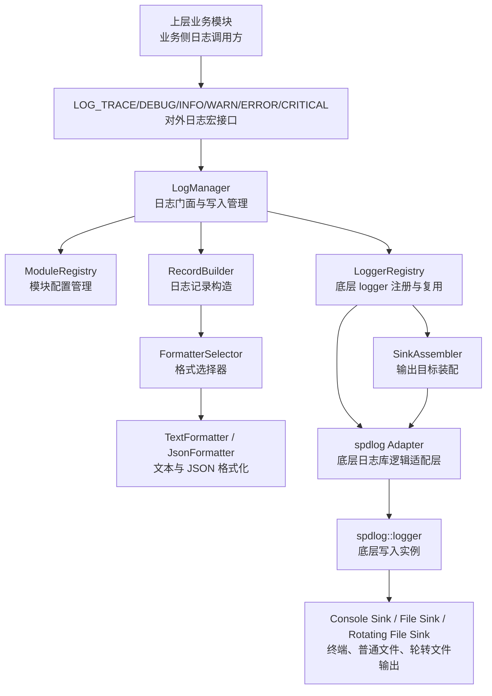

# LogWriter 模块详细设计

## 1. 修订记录

| 版本 | 日期 | 作者 | 说明 |
| --- | --- | --- | --- |
| v0.1 | 2026-06-19 | Codex | 基于 `log_module/common` 代码整理 LogWriter 模块详细设计 |

## 2. 模块定位

`LogWriter` 模块是日志系统中面向文本日志的统一封装层。

其核心职责不是定义业务语义，而是：

1. 对外提供统一日志写入入口
2. 对内完整封装底层开源日志库能力
3. 为上层业务模块提供一致的文本日志能力
4. 仅对日志格式进行项目级自定义
5. 根据上层传入的目标文件执行稳定落盘

当前实现基于 `spdlog`，但上层模块不应直接依赖 `spdlog` 细节。

在职责边界上，`LogWriter` 只负责“把内容写入指定文件”，不负责制定文件命名规则、决定何时分段、何时压缩以及何时清理。

## 3. 设计目标

1. 对上提供稳定的统一接口
2. 对下完整封装 `spdlog` 能力
3. 除日志格式外，尽量直接复用 `spdlog` 原生机制
4. 支持未来替换为其他开源日志实现时，仅调整本模块内部

## 4. 总体设计

### 4.1 架构分层

`LogWriter` 模块内部划分为以下几层：

1. 日志门面层
2. 模块配置层
3. `spdlog` 适配层
4. 自定义格式层
5. 输出策略层

其中，日志门面层的对外实现统一命名为 `LogManager`。

### 4.2 模块关系



其中，`spdlog Adapter` 在此处表示逻辑适配层概念，用于承接级别映射、sink 装配、logger 初始化等与底层日志库相关的适配职责，不要求与代码目录中的单一文件或单一类一一对应。

### 4.3 对外接口形式

`LogWriter` 对外固定提供如下两类接口：

1. 初始化接口
2. 日志写入宏

典型调用方式如下：

```cpp
naviai::log::LogManager::Init(LOG_LEVEL_DEBUG, "/custom/log/path");

LOG_TRACE("LOCALIZATION", "trace message");
LOG_DEBUG("LOCALIZATION", "debug message");
LOG_INFO("LOCALIZATION", "info message");
LOG_WARN("LOCALIZATION", "warn message");
LOG_ERROR("LOCALIZATION", "error message");
LOG_CRITICAL("LOCALIZATION", "critical message");
```

这里的设计约束是：

1. 外部调用形式尽量接近普通 `print`
2. 外部不直接感知 `spdlog` 类型
3. 日志级别通过统一宏传入
4. 模块通过通用字符串标识传入
5. 目标文件路径由上层功能层按统一规则传入
6. 内部再完成级别映射、格式化、sink 装配和落盘

这里的上层功能层通常指 `L1` 或 `L3`。它们先通过 `LogService` 的命名规则生成当前活跃文件，再把该文件交给 `LogWriter` 持续写入。

## 5. 对 `spdlog` 的封装设计

### 5.1 `spdlog` 原生能力概览

`spdlog` 本身支持的能力比当前项目实际使用的更多，主要包括：

1. 日志写入：支持同步写入和异步写入
2. 日志级别：支持 `trace/debug/info/warn/error/critical`
3. 日志格式：支持时间、线程 `ID`、源码文件、行号、函数名等格式化输出
4. 日志轮转：支持按大小轮转和按日期切分
5. 保留数量：支持配置保留最近 `N` 个历史文件
6. 多输出目标：支持文件、终端、`syslog` 以及自定义 sink
7. 异步队列：支持后台线程写日志
8. 队列满策略：支持阻塞或丢弃旧日志

### 5.2 LogWriter 计划完整封装的 `spdlog` 能力

`LogWriter` 模块应将 `spdlog` 的以下能力作为标准能力整体封装，而不是在外围重复自研：

1. 同步写入
2. 异步写入
3. 日志级别控制
4. 日志格式基础能力
5. 按大小轮转
6. 多 sink 输出
7. 异步队列
8. 队列满策略
9. `flush` 策略
10. 错误处理回调

其中，项目侧只额外补充一层自定义格式封装，用于插入模块、上下文和扩展字段。

### 5.3 级别封装

平台级别与 `spdlog` 级别之间需要有统一映射关系。

映射内容包括：

1. 自定义日志级别到 `spdlog` 级别的映射
2. 自定义日志级别到级别名称字符串的映射

对外建议统一暴露级别宏，而不是直接暴露 `spdlog::level::*`：

1. `LOG_LEVEL_TRACE`
2. `LOG_LEVEL_DEBUG`
3. `LOG_LEVEL_INFO`
4. `LOG_LEVEL_WARN`
5. `LOG_LEVEL_ERROR`
6. `LOG_LEVEL_CRITICAL`

封装目的：

1. 上层只依赖 `LogLevel`
2. 内部在写入前统一映射到底层 `spdlog` 级别
3. 后续若更换底层日志库，只修改映射层即可

### 5.4 logger 注册封装

`LoggerRegistry` 负责对 `spdlog::logger` 进行统一管理。

实现方式：

1. 以模块名为键保存 `logger`
2. 首次注册时创建 `spdlog::logger`
3. 根据配置挂接具体 sink
4. 在写入前利用 `logger->should_log()` 做级别判断

这样设计的目的：

1. 将“是否记录”与“如何落盘”解耦
2. 保持模块级别管理能力
3. 避免上层直接操作 `spdlog::logger`

### 5.5 格式化封装

`LogWriter` 唯一需要明显项目化定制的部分是格式层。

当前通过以下组件对日志格式进行统一封装：

1. `TextFormatter`
2. `JsonFormatter`
3. `FormatterSelector`

这样做的好处：

1. 输出格式不受 `spdlog` 默认 pattern 约束
2. 文本与 JSON 输出可以统一切换
3. 便于加入模块、上下文、扩展字段等项目自定义信息

### 5.6 Sink 封装

`LogWriter` 对外不直接暴露 `spdlog` sink 类型，但内部应尽量直接复用 `spdlog` sink 能力。

推荐封装方式：

1. 控制台输出：封装控制台 sink
2. 文件输出：封装 `basic file sink`
3. 按大小轮转：封装 `rotating file sink`
4. 多目标输出：直接组合多个 sink

封装目的：

1. 上层不感知具体 sink 类型
2. 输出策略可通过配置统一切换
3. 后续替换底层库时，不影响上层调用

### 5.7 异步能力封装

异步能力应优先直接复用 `spdlog` 的异步 logger、异步线程池与队列策略。

需要封装的内容主要包括：

1. 队列大小配置
2. 工作线程数配置
3. 队列满时的策略选择
4. 是否启用异步模式的开关

### 5.8 轮转与保留策略封装

轮转与保留策略应优先直接复用 `spdlog` 原生能力：

1. 按大小轮转：`rotating sink`

`LogWriter` 本身不负责：

1. 压缩旧文件
2. 跨目录扫描
3. 统一清理过期文件
4. 文件保留数量治理
5. 全局配额控制

这些能力属于 `LogAgent`。

### 5.9 多输出目标封装

`spdlog` 原生支持多 sink 输出，`Logger` 只需要在配置层统一组织这些 sink。

典型组合方式包括：

1. 终端 + 文件
2. 终端 + 轮转文件
3. 多个文件 sink 组合

因此这里的设计重点不是自定义 sink 框架，而是统一 sink 配置与装配方式。

## 6. 模块设计

`LogWriter` 模块按以下 7 类核心能力进行设计：

1. 日志级别
2. 同步 / 异步写入接口
3. 格式化
4. 多 `sink` 输出
5. 基础 `flush`
6. 基础错误处理
7. 轻量轮转

### 6.1 日志级别设计

`LogWriter` 负责统一封装日志级别能力。

设计内容：

1. 对外暴露统一日志级别宏
2. 内部统一使用自定义 `LogLevel`
3. 支持模块级别控制
4. 支持全局级别控制

推荐对外形式：

1. `LOG_LEVEL_TRACE`
2. `LOG_LEVEL_DEBUG`
3. `LOG_LEVEL_INFO`
4. `LOG_LEVEL_WARN`
5. `LOG_LEVEL_ERROR`
6. `LOG_LEVEL_CRITICAL`

级别控制规则：

1. 全局级别作为默认级别作用于所有模块
2. 未单独配置级别的模块跟随全局级别
3. 已单独配置级别的模块优先使用模块级别
4. 后续调整全局级别时，不覆盖已设置模块级别的模块

### 6.2 同步 / 异步写入接口设计

`LogWriter` 对外统一提供写入接口，对内选择同步或异步模式。

设计内容：

1. 同步写入模式
2. 异步写入模式
3. 异步队列大小配置
4. 工作线程数配置
5. 队列满策略配置

实现原则：

1. 优先复用 `spdlog` 原生异步能力
2. 上层不感知同步 / 异步细节
3. 写入接口保持一致

### 6.3 格式化设计

`LogWriter` 唯一显式自定义的能力是日志格式。

设计内容：

1. 文本格式输出
2. JSON 格式输出
3. 项目级字段注入

推荐自定义字段包括：

1. 时间戳
2. 模块名
3. 级别
4. 消息内容
5. 输出组

### 6.4 多 Sink 输出设计

`LogWriter` 负责统一组织多个输出目标。

设计内容：

1. 终端输出
2. 普通文件输出
3. 按大小轮转文件输出
4. 多 sink 组合输出

实现原则：

1. 内部直接复用 `spdlog` sink
2. 上层只通过配置选择输出目标
3. 上层不直接创建或管理 sink

### 6.5 基础 Flush 设计

`LogWriter` 负责基础刷新能力。

设计内容：

1. 手动 `Flush`
2. 周期性 `Flush`
3. `Shutdown` 前强制刷新

实现原则：

1. 刷新能力仅保证日志尽快落盘
2. 不承担日志压缩、清理等后置管理动作

### 6.6 基础错误处理设计

`LogWriter` 负责基础错误处理能力。

设计内容：

1. 初始化失败处理
2. 写入失败处理
3. 刷新失败处理
4. 后端错误回调
5. 最小降级输出

实现原则：

1. 优先复用 `spdlog` 原生错误处理能力
2. 通过统一错误处理函数输出内部错误信息
3. 当正常写入链路失败时，至少降级输出到 `stderr`
4. 不把文件治理问题耦合到 `Logger`

设计约束：

1. `LogWriter` 内部错误需要统一记录
2. sink 与底层 logger 的错误回调需要统一收口
3. 当正常写入链路失败时，需要具备最小降级输出能力
4. 降级输出仅用于兜底，不承担正式日志存储职责

### 6.7 轻量轮转设计

`LogWriter` 只负责轻量轮转能力，不负责压缩与清理。

设计内容：

1. 按大小轮转
2. 控制单文件大小上限

实现原则：

1. 优先直接复用 `spdlog` 原生 sink
2. 仅把按大小切分作为写入侧能力
3. 文件保留数量、压缩、统一清理、扫描、配额控制交由 `LogAgent`

### 6.8 文件目标与写入边界设计

`LogWriter` 需要知道“写到哪个文件”，但不负责“决定文件应该叫什么”。

设计边界如下：

1. `L1/L3` 根据业务时机发起日志写入
2. `LogService` 提供统一命名规则，并生成当前活跃文件
3. `L1/L3` 将目标文件路径传递给 `LogWriter`
4. `LogWriter` 负责打开、复用、刷新并持续写入该文件
5. 当需要分段时，由 `LogService` 按规则关闭旧文件并生成新文件
6. `LogWriter` 在收到新的目标文件后切换写入对象

这样设计的目的：

1. 文件命名规则只有一套
2. 写入能力与文件治理能力解耦
3. 分段、压缩、清理、恢复都可以复用同一套文件语义

## 7. 运行流程设计

### 7.1 初始化流程

初始化阶段的核心流程如下：

1. 解析并校验 `LoggerConfig`
2. 初始化模块配置表
3. 初始化格式化器
4. 根据配置创建 `spdlog` sink 组合
5. 根据配置创建同步或异步 logger
6. 配置默认日志级别
7. 配置 `flush` 策略

### 7.2 写入流程

运行时写入的主要流程如下：

1. `L1/L3` 先依据业务动作选择当前日志文件
2. 文件命名与活跃文件生成遵循 `LogAgent` 统一规则
3. `LogWriter` 检查模块 logger 是否存在
4. `LogWriter` 判断当前级别是否需要写入
5. 由日志记录构造层生成标准记录对象
6. 由格式层生成最终输出字符串
7. 调用底层日志实例写入目标文件
8. 若启用异步，则由后台线程完成实际落盘

### 7.3 刷新与关闭流程

1. `Flush` 触发 logger 或 sink 的刷新
2. `Shutdown` 刷新当前数据
3. 停止异步 logger 或线程池
4. 释放 sink 和 logger 资源
5. 将模块置为未初始化
6. 文件分段、压缩和清理由 `LogAgent` 在写入侧之外继续处理

## 8. 数据结构设计

### 8.1 模块配置

```cpp
struct ModuleConfig {
    std::string module_name;  // 模块名
    std::string output_group; // 输出组
    LogLevel level;           // 模块当前生效级别
    bool custom_level;        // 是否已单独设置模块级别
};
```

### 8.2 日志记录对象

```cpp
struct LogRecord {
    int64_t timestamp_us{0};         // 记录时间
    std::string module_name;         // 模块名
    std::string output_group;        // 输出组
    LogLevel level;                  // 自定义日志级别
    std::string payload;             // 文本消息
};
```

### 8.3 全局运行状态

推荐的运行时状态可抽象为：

```cpp
struct LoggerRuntimeState {
    LoggerConfig config;                            // 当前配置
    std::unordered_map<std::string, ModuleConfig> module_registry; // 模块配置表
    LoggerRegistry logger_registry;                 // 模块 logger 注册表
    std::shared_ptr<FormatterSelector> formatter_selector; // 格式选择器
    bool initialized{false};                        // 是否已初始化
};
```

### 8.4 配置对象

```cpp
struct LoggerConfig {
    std::string root_dir;               // 日志根目录
    LogLevel level;                     // 默认级别
    std::string file_name;              // 当前写入目标文件名
    size_t max_file_size_bytes;         // 默认单文件大小
    size_t max_files;                   // 最大文件数
    size_t async_queue_size;            // 异步队列大小
    size_t async_worker_threads;        // 异步工作线程数
    size_t flush_interval_seconds;      // flush 周期
    AsyncOverflowPolicy async_overflow_policy; // 队列满策略
    bool async_mode;                    // 是否启用异步
    bool enable_basic_file_sink;        // 是否启用普通文件输出
    bool enable_rotating_file_sink;     // 是否启用轮转文件输出
    bool enable_console_sink;           // 是否启用控制台输出
    OutputFormat output_format;         // 输出格式
};
```

## 9. 与 `spdlog` 的解耦策略

当前 `LogWriter` 模块虽然内部使用 `spdlog`，但设计上需要保持如下边界：

1. 上层不直接创建 `spdlog::logger`
2. 上层不直接依赖 `spdlog` sink 类型
3. 上层不直接依赖 `spdlog` pattern 细节
4. 上层只依赖 `LogManager`、日志级别宏、模块名字符串和公共接口
5. 上层只向 `LogWriter` 传递目标文件，不直接操作底层写入实例

如果未来替换为其他开源日志库，需要调整的主要位置包括：

1. 级别映射函数
2. `LoggerRegistry`
3. sink 装配策略
4. 异步 logger 初始化策略
5. 与底层 logger 生命周期相关的初始化和关闭逻辑

而不需要修改的部分包括：

1. 上层模块调用方式
2. `LogRecord` 结构
3. 自定义格式层
4. 模块配置与记录构造层

## 10. 结论

`LogWriter` 模块当前已经形成了较完整的统一封装结构：

1. 对上提供稳定日志接口
2. 对内完成 `spdlog` 级别、logger、sink、异步、轮转等能力的统一封装
3. 仅对日志格式和模块配置做项目级定制
4. 可以作为后续替换底层开源日志库时的唯一改动边界
