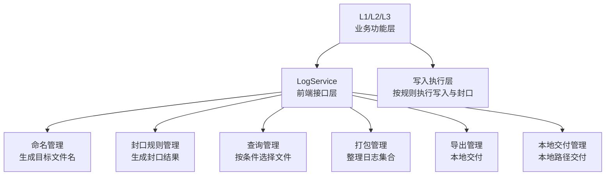

# LogService 模块详细设计

## 1. 修订记录

| 版本 | 日期 | 作者 | 说明 |
| --- | --- | --- | --- |
| v0.1 | 2026-06-19 | Codex | 新建 `LogService` 模块详细设计 |
| v0.2 | 2026-06-20 | Codex | 按前端接口层定位重整职责与接口描述 |
| v0.3 | 2026-06-20 | Codex | 增加启动前未封口恢复接口与职责边界说明 |

## 2. 模块定位

`LogService` 是日志系统中的前端接口层。

它不负责日志内容本身的落盘实现，也不负责后台扫描、压缩和清理，而是负责对外提供统一的控制语义与查询交付能力，统一管理日志文件的命名规则、封口规则、查询与交付动作。

职责边界上：

1. 写入执行层负责日志内容写入与具体文件操作
2. `L2` 负责原始数据与索引文件写入，并按 `LogService` 规则执行命名与封口动作
3. `LogService` 负责前端接口语义、命名规则、封口规则、启动前未封口恢复、查询与对外交付接口
4. `LogAgent` 负责后台扫描、压缩、清理与统计治理；未封口文件的前台恢复优先由 `LogService` 侧接口触发

## 3. 设计目标

1. 为 `L1/L2/L3` 提供统一的前端接口语义
2. 统一日志文件命名规则和封口规则
3. 提供可复用的文件生命周期控制规则
4. 提供查询、打包、导出、本地交付等对外服务能力
5. 与具体写入执行层、`LogAgent` 解耦，保持职责清晰

## 4. 总体设计

### 4.1 模块职责

`LogService` 负责以下几类能力：

1. 文件命名管理
2. 封口规则管理
3. 启动前未封口恢复管理
4. 查询管理
5. 打包管理
6. 导出管理
7. 本地交付管理

### 4.2 模块关系



接口约束：

1. `LogService` 输出的是规则、命名结果和查询交付结果，而不是写入运行态
2. 写入执行层可根据需要在不同日志层中各自实现，不要求由 `LogService` 直接持有活跃文件状态
3. 同一套命名与封口规则应适用于文本日志、原始数据日志与会话元数据

### 4.3 文件命名规则

`LogService` 负责统一生成日志文件名，命名语义如下：

1. 文件名由开始时间、结束时间和后缀组成
2. 时间命名规则由 `LogService` 统一定义
3. 活跃文件只包含开始时间
4. 文件封口后补齐结束时间

示意形式如下：

```text
<start_time>-<end_time>.<suffix>
```

其中：

1. 活跃文件：`<start_time>-.<suffix>`
2. 已封口文件：`<start_time>-<end_time>.<suffix>`

### 4.4 对外接口清单

`LogService` 对外提供以下直接调用接口：

1. 活跃文件命名规划接口：生成活跃文件目标路径
2. 封口文件命名规划接口：生成封口后的目标路径
3. 活跃路径到封口路径转换接口：根据已有活跃路径生成封口结果
4. 活跃路径识别接口：判断目标文件是否仍处于未封口命名状态
5. 启动前恢复接口：根据活跃路径集合和结束时间执行统一封口恢复
6. 查询接口：按条件查询日志文件集合
7. 打包接口：按条件生成日志包
8. 导出接口：将日志包导出到本地目标目录
9. 交付接口：将日志包交付到本地目标路径

接口返回形式建议如下：

1. 命名规划接口：同步返回命名结果
2. 查询接口：同步返回查询结果集
3. 打包接口：返回任务结果或任务标识
4. 导出接口：返回交付任务结果或任务标识
5. 交付接口：返回交付任务结果或任务标识

## 5. 模块划分

### 5.1 文件命名管理

职责：

1. 定义统一文件命名规则
2. 根据日志类型生成文件后缀
3. 生成活跃文件名与封口文件名
4. 判断文件是否处于活跃命名状态
5. 保证文件名时间语义合法

### 5.2 封口规则管理

职责：

1. 定义活跃文件到封口文件的时间转换规则
2. 生成封口文件名
3. 为启动恢复场景提供活跃态到封口态的统一转换规则
4. 保证封口结果与命名规则一致
5. 为各日志层提供统一封口语义

### 5.3 启动前未封口恢复管理

职责：

1. 接收活跃文件路径集合
2. 基于统一 active 到 sealed 规则生成恢复目标路径
3. 在启动阶段执行封口重命名
4. 处理目标路径冲突并输出恢复结果
5. 不直接解析业务日志内容中的最后一条记录时间

### 5.4 查询管理

职责：

1. 接收按时间、模块、层级等条件的查询请求
2. 选择满足条件的日志文件集合
3. 对外返回文件结果或任务结果
4. 支持在统一目录约定下查询多类日志文件

### 5.5 打包管理

职责：

1. 按时间窗口、任务或事件收集文件
2. 生成日志归档集合
3. 输出打包描述信息
4. 为导出与本地交付提供输入

### 5.6 导出管理

职责：

1. 将打包结果导出到目标目录
2. 记录导出任务状态
3. 处理覆盖检查、路径校验和失败回滚

### 5.7 本地交付管理

职责：

1. 将打包结果交付到本地目标路径
2. 记录交付任务状态
3. 支持失败重试与结果说明

## 6. 模块设计

### 6.1 文件命名管理设计

设计流程：

1. 接收日志类型、文件后缀和时间语义
2. 生成开始时间与结束时间语义
3. 组合目录、文件名和后缀
4. 识别目标路径是否为活跃命名
5. 返回活跃或封口命名结果

设计原则：

1. 命名规则必须统一
2. 文件名时间语义必须稳定
3. 命名结果必须能被 `LogAgent` 正确识别
4. 同一规则应适用于数据文件、索引文件与会话元数据文件
5. 各日志层可基于该规则自行完成启动恢复场景下的封口执行

### 6.2 封口规则管理设计

设计流程：

1. 接收活跃文件的命名信息
2. 读取开始时间与文件后缀
3. 获取结束时间语义
4. 判断输入路径是否仍为未封口命名
5. 生成封口后的目标命名结果
6. 将结果交给写入执行层或调用方使用

设计原则：

1. 封口后的结束时间不得早于开始时间
2. 封口规则必须独立于具体写入实现
3. `LogService` 只负责封口规则与目标命名，不负责解析各日志格式中的最后一条记录时间
4. 封口完成后应可立即被查询和打包识别

### 6.3 启动前未封口恢复设计

设计流程：

1. 调用方在启动阶段扫描未封口活跃文件
2. 调用方自行解析最后一条有效记录时间
3. `LogService` 接收活跃路径集合和结束时间
4. `LogService` 按统一 active 到 sealed 规则生成恢复目标路径
5. 若目标路径冲突，`LogService` 生成带 `_recovered_<n>` 后缀的替代路径
6. `LogService` 执行统一重命名并返回恢复结果

设计原则：

1. 启动前未封口恢复属于前台控制动作，应由前端服务接口承载
2. `LogService` 负责统一封口命名与冲突处理，不负责解析原始文件内容
3. 恢复动作必须先于新的活跃文件创建执行
4. 恢复完成后文件应立即进入已封口状态，后续压缩交给 `LogAgent`

### 6.4 查询管理设计

设计目标：

1. 支持日志文件级查询
2. 支持按时间范围、模块、层级等条件查询
3. 支持在统一目录约定下查询不同日志类型

设计流程：

1. 接收查询条件
2. 从可用文件集中筛选目标文件
3. 返回匹配结果

设计要点：

1. 查询属于对外服务能力
2. 查询能力由 `LogService` 直接执行，无需经过其他模块
3. 查询默认面向 `root_dir` 下的目标文件集合
4. 若只希望查询某一类日志，应显式传入 `QueryCondition.file_type`

### 6.5 打包管理设计

设计流程：

1. 接收时间窗口、任务或事件条件
2. 查询目标文件集合
3. 将目标文件复制到临时目录
4. 生成打包描述文件
5. 输出归档结果与任务状态

设计要点：

1. 打包输入应为已完成命名规则闭环的文件
2. 打包范围应可追溯
3. 打包动作应保留任务状态与失败原因
4. 打包由 `LogService` 直接执行，无需经过其他模块
5. 打包默认扫描 `root_dir` 下全部日志目录；若只希望打包某一类日志，应显式传入 `QueryCondition.file_type`
6. 打包接口建议返回任务结果或任务标识

### 6.6 导出管理设计

设计流程：

1. 接收导出请求与导出目标目录
2. 获取打包结果
3. 校验目标目录与覆盖策略
4. 执行导出
5. 记录导出结果

设计要点：

1. 导出属于本地交付动作
2. 导出失败应支持回滚或明确失败标记
3. 导出结果应可追踪
4. 导出由 `LogService` 直接执行，无需经过其他模块
5. 导出接口建议返回任务结果或任务标识

### 6.7 本地交付管理设计

设计流程：

1. 接收交付请求与本地目标路径
2. 获取打包结果
3. 执行本地复制交付
4. 记录交付结果

设计要点：

1. 本地交付属于本地文件分发动作
2. 交付失败应支持有限次重试
3. 超过重试上限后应转为失败任务
4. 本地交付由 `LogService` 直接执行，无需经过其他模块
5. 交付接口建议返回任务结果或任务标识

### 6.7 当前方案约束

当前设计中，`LogService` 仅承担前端接口层能力，不直接承担写入执行状态。

约束如下：

1. `LogService` 输出的是命名结果、封口结果与查询打包结果，而不是活跃写入句柄
2. 写入执行层可由各日志层按自身需要实现
3. 多文件、多目录或多 topic 写入场景不要求由 `LogService` 自身持有统一运行态
4. 只要命名规则一致，文本日志、原始数据日志与会话元数据均可复用同一套接口语义

## 7. 数据结构设计

### 7.1 文件命名规划对象

文件命名规划对象用于表达一次命名规则计算结果，至少应包含以下信息：

1. 目标文件路径
2. 文件类型
3. 文件后缀或格式标识
4. 文件开始时间
5. 文件结束时间
6. 是否已经完成封口

### 7.2 服务策略对象

服务策略对象用于描述 `LogService` 的通用行为约束，当前重点关注：

1. 本地交付失败后的最大重试次数
2. 导出与交付阶段的通用策略项
3. 供查询、打包、交付流程共享的基础策略信息

### 7.3 查询条件对象

查询条件对象用于描述日志选择范围，建议包含以下维度：

1. 查询开始时间
2. 查询结束时间
3. 文件类型
4. 模块名
5. 文件后缀或格式筛选条件

### 7.4 打包任务对象

打包任务对象用于表达一次打包动作的过程与结果，建议包含以下信息：

1. 任务标识
2. 打包筛选条件
3. 打包输出路径
4. 打包描述文件路径
5. 任务状态
6. 任务结果说明
7. 原始文件集合信息

### 7.5 交付任务对象

交付任务对象用于表达导出或本地交付动作，建议包含以下信息：

1. 任务标识
2. 任务类型
3. 交付源路径
4. 交付目标路径
5. 任务状态
6. 任务结果说明
7. 当前重试次数

### 7.6 LogService 运行时状态

`LogService` 运行时状态对象主要用于表达当前服务策略视图，重点包含：

1. 当前服务策略
2. 交付类动作的通用约束
3. 可供外部读取的基础状态信息

## 8. 设计边界说明

`LogService` 是前端接口层，不是后台治理模块，也不是日志内容写入模块。

边界说明如下：

1. 写入执行层负责日志内容写入与具体文件操作
2. `LogService` 负责文件命名规则、封口规则、启动前未封口恢复、查询、打包、导出、本地交付
3. `LogAgent` 负责扫描、压缩、清理与统计；对未封口文件的处理依赖前台恢复结果
4. `LogService` 可选复用 `LogAgent` 的治理结果，但对外接口本身无需经过 `LogAgent`

## 9. 结论

`LogService` 的本质是日志系统中的前端接口与对外服务模块。

它需要统一承担以下能力：

1. 文件命名规则
2. 封口规则
3. 查询管理
4. 打包管理
5. 导出管理
6. 本地交付管理
