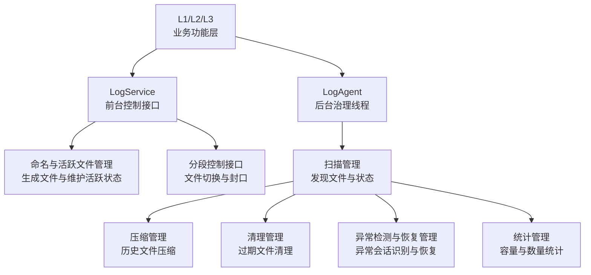

# LogAgent 模块详细设计

## 1. 修订记录

| 版本 | 日期 | 作者 | 说明 |
| --- | --- | --- | --- |
| v0.1 | 2026-06-19 | Codex | 新建 `LogAgent` 模块详细设计 |

## 2. 模块定位

`LogAgent` 是日志系统中文件生命周期与运维治理的后台管理模块。

它不负责业务日志内容生成，也不负责日志内容本身的实时写入。

在模块边界上，`LogService` 与 `LogAgent` 是两个独立模块：

1. `LogService` 负责命名、活跃文件创建、分段、封口、取日志前强制切段等同步控制动作
2. `LogAgent` 负责扫描、压缩、清理、异常恢复等异步治理动作

职责边界上：

1. `LogWriter` 负责写入侧的文本日志生成、稳定落盘与基础异常兜底
2. `L2` 负责原始数据与索引文件的写入
3. `LogService` 负责统一命名规则、活跃文件管理与分段接口
4. `LogAgent` 负责扫描、压缩、清理、异常检测与恢复、统计治理

## 3. 设计目标

1. 统一管理日志文件生命周期
2. 提供扫描、压缩、清理、异常检测与恢复等基础能力
3. 为 `L1/L2/L3` 提供统一的文件治理能力
4. 将恢复、治理与统计动作收口到统一模块，避免能力分散
5. 通过后台线程机制避免治理动作阻塞前台写入链路

## 4. 总体设计

### 4.1 模块职责

`LogAgent` 只负责后台治理线程能力：

1. 扫描管理
2. 压缩管理
3. 清理管理
4. 异常检测与恢复管理
5. 统计管理

### 4.2 调度模型

日志系统中，`LogService` 与 `LogAgent` 是两个独立模块，分别承担前台控制与后台治理职责。

模块关系如下：

1. `LogService`：负责启动、停止、命名、分段、封口、手动触发治理动作和查询状态
2. `LogAgent`：负责启动后自检、周期扫描、压缩、清理、异常恢复以及其他后置治理动作

调度原则如下：

1. 命名与分段属于 `LogService` 的前台接口能力，不由后台线程轮询触发
2. 分段后的治理动作由 `LogAgent` 接管
3. 压缩、清理、恢复等动作在后台执行，不阻塞写入
4. 后台线程按固定周期巡检目录与任务状态
5. 紧急任务可由事件触发立即执行，而不必等待下一个周期

### 4.3 总体架构图



### 4.4 文件命名规则

`LogAgent` 依赖 `LogService` 生成的统一文件命名规则对日志文件进行识别、扫描、恢复与清理。

统一命名语义如下：

1. 文件名由开始时间、结束时间和文件后缀组成
2. 文件命名使用文件生命周期时间，不使用消息体内部时间戳
3. 活跃文件在写入过程中仅包含开始时间
4. 文件关闭、分段或归档后补齐结束时间
5. 不同日志类型通过不同后缀区分

示意形式如下：

```text
<start_time>-<end_time>.<suffix>
```

其中：

1. 活跃文件：`<start_time>-.<suffix>`
2. 已关闭文件：`<start_time>-<end_time>.<suffix>`

设计约束：

1. 文件名中的时间用于文件级治理，不用于替代文件内容中的消息时间
2. 扫描管理需要依据命名规则识别活跃文件与历史文件
3. 异常检测与恢复需要依据命名规则识别未正常关闭文件
4. 清理与统计需要依据命名规则解析文件时间范围
5. 分段管理需要依据命名规则关闭旧文件并生成新文件
6. 文件命名、分段判断、扫描治理与清理窗口一律使用系统时间

## 5. 模块划分

### 5.1 扫描管理

职责：

1. 扫描日志根目录
2. 识别已封口文件、压缩文件与异常文件
3. 为压缩、清理、恢复与统计提供输入集合
4. 输出统一文件清单与状态视图

### 5.2 压缩管理

职责：

1. 将已关闭的历史文件加入压缩队列
2. 后台异步执行压缩
3. 压缩失败时保留原文件并记录异常状态
4. 为后续清理和统计提供压缩产物

### 5.3 清理管理

职责：

1. 仅保留最近 `48` 小时内的历史文件
2. 删除超过 `48` 小时保留窗口的历史文件
3. 支持手动清理与 `dry-run`

### 5.4 异常检测与恢复管理

职责：

1. 检测日志是否未正常关闭
2. 检测进程异常退出、崩溃或 `coredump` 等场景下残留的日志状态
3. 识别未封口文件、临时文件、未完成压缩文件等异常产物
4. 在系统下次启动时执行恢复、标记或补救动作
5. 为工具层提供异常会话识别、状态定位能力

### 5.5 统计管理

职责：

1. 统计各层日志条数
2. 统计文件数、目录容量和时间分布
3. 统计异常会话数量和恢复状态
4. 为运维决策提供输入

## 6. 模块设计

### 6.1 扫描管理设计

设计流程：

1. 从根目录开始扫描
2. 识别普通日志文件、压缩文件、已封口文件与异常文件
3. 过滤目录、临时文件和非法命名文件
4. 解析文件的时间信息、层级信息与状态信息
5. 输出统一候选文件集合

设计原则：

1. 扫描结果应统一供压缩、清理、恢复与统计复用
2. 扫描阶段只做识别与分类，不直接修改文件
3. 扫描结果需要可缓存、可复查、可增量更新

### 6.2 压缩管理设计

设计流程：

1. 从扫描结果中选取已关闭的历史文件
2. 按策略加入压缩队列
3. 后台异步执行压缩
4. 压缩成功后更新文件状态
5. 压缩失败时保留原文件并记录异常状态

设计要点：

1. 压缩是异步动作
2. 压缩不能阻塞前台写入
3. 压缩失败不能影响其余文件治理动作
4. 压缩结果需要能被清理与统计识别

压缩产物规则：

1. 压缩完成后生成统一后缀的压缩文件
2. 压缩成功前不删除原始文件
3. 压缩成功后是否删除原始文件，应由统一策略控制
4. 压缩失败时不保留半成品压缩文件

失败处理规则：

1. 压缩失败后应记录失败状态
2. 失败文件应进入待重试队列，而不是直接丢弃
3. 连续失败达到上限后，应转入异常状态，等待人工处理或后续恢复流程接管
4. 处于压缩失败状态的文件，不应被自动清理流程直接删除

### 6.3 清理管理设计

清理管理分为自动清理与手动清理两类能力。

自动清理流程：

1. 扫描目录
2. 解析文件时间信息
3. 跳过异常文件和受保护文件
4. 删除超过 `48` 小时保留窗口的历史文件

手动清理流程：

1. 指定根目录与清理条件
2. 支持 `dry-run`
3. 输出待删除结果集
4. 在确认后执行删除动作

设计要点：

1. 清理动作不能误删活跃文件
2. 清理动作应支持演练与审计
3. 清理动作应与异常恢复结果联动

### 6.4 异常检测与恢复设计

异常检测与恢复能力属于 `LogAgent` 的核心治理职责，不属于 `Logger`。

设计目标：

1. 在系统重启后识别上次日志会话是否未正常结束
2. 在系统重新启动时识别上次运行残留的文件状态，`coredump` 只是其中一种可能来源
3. 将异常文件与正常关闭文件区分管理
4. 为后续清理、统计与问题分析提供异常标记

设计流程：

1. 启动时优先扫描日志根目录
2. 识别仍带有活跃标记、缺少结束标记或命名不完整的日志文件
3. 识别未完成压缩、未正常关闭的中间产物
4. 根据规则执行恢复动作，例如补齐状态、移动到异常目录、标记异常结束
5. 生成异常会话记录，供统计与工具层使用

设计原则：

1. 恢复动作不能破坏原始日志文件
2. 无法自动修复时，应优先标记并保留现场
3. 异常恢复应在系统启动阶段优先执行
4. 恢复结果应可被统计和复核
5. 文件名仅包含开始时间的文件，应视为未正常封口文件

恢复规则补充：

1. 系统启动后，后台线程应优先检查当前目录中是否存在未分段文件
2. 文件名只有开始时间的文件，必须先补齐结束时间并完成分段封口
3. 已封口但未压缩的文件，需要继续补齐后续治理动作
4. 异常恢复完成前，不应直接对外提供不完整文件

结束时间补齐规则：

1. 开机自检时，若发现文件名只有开始时间，则读取该文件内最后一条日志记录的系统时间
2. 若最后一条日志时间晚于或等于开始时间，则将其写为文件结束时间
3. 若最后一条日志时间早于开始时间，则将结束时间回写为开始时间
4. 通过该规则保证文件名中的结束时间不早于开始时间

恢复失败处理规则：

1. 若自动恢复失败，应保留原始文件
2. 恢复失败文件可移动到异常目录，或在原目录中标记为异常文件
3. 恢复失败文件在人工处理前不应被自动清理

### 6.5 统计管理设计

设计方式：

1. 基于扫描结果统计文件维度信息
2. 基于扫描结果或离线分析结果统计内容维度信息
3. 基于异常会话对象统计治理维度信息

统计内容包括：

1. 各层日志数量
2. 各模块日志数量
3. 文件数与目录容量
4. 异常会话数量
5. 恢复成功与失败数量

### 6.6 后台线程与调度设计

`LogAgent` 采用常驻后台线程持续执行治理动作。

设计内容：

1. 后台线程启动与停止机制
2. 周期巡检间隔配置
3. 压缩、清理、恢复任务的调度顺序
4. 线程异常退出后的自恢复策略

启动与停止规则：

1. `LogAgent` 由系统启动流程或主控模块显式启动
2. `LogAgent` 启动后必须先执行一次目录自检与恢复
3. `LogAgent` 停止前应完成当前收尾压缩任务，或将未完成任务显式标记

推荐调度方式：

1. 中频处理已关闭文件压缩
2. 低频执行全目录扫描和过期清理
3. 启动阶段优先执行异常恢复
4. 退出阶段优先执行收尾封口与压缩

设计原则：

1. 后台线程不直接阻塞前台写入
2. 治理任务应串行或受控并行，避免相互抢占
3. 调度状态应可观测、可复核、可恢复
4. 启动、取日志、退出三个阶段都应具备显式收尾规则
5. 命名与分段由 `LogService` 显式触发，`LogAgent` 只接管其结果

## 7. 数据结构设计

### 7.1 文件状态对象

```cpp
struct LogFileEntry {
    std::filesystem::path path;   // 文件路径
    std::string file_type;        // 文件类型
    std::string file_state;       // 文件状态
    int64_t start_time_us;        // 开始时间
    int64_t end_time_us;          // 结束时间
    size_t size_bytes;            // 文件大小
};
```

`file_state` 建议采用统一状态集合：

1. `sealed`：已封口、未压缩文件
2. `compressed`：已完成压缩
3. `abnormal`：异常文件或异常任务

说明：

1. 当前实现未对外暴露 `active` 状态
2. 当前实现也未维护对外可观测的 `compressing` 中间态
3. 文件名只有起始时间、缺失结束时间时，当前实现按 `abnormal` 处理，并进入异常恢复流程

### 7.2 文件治理策略

```cpp
struct FileGovernPolicy {
    int64_t retention_window_seconds; // 保留窗口
    int64_t scan_interval_ms;         // 扫描周期
    int64_t cleanup_interval_ms;      // 清理周期
    size_t compress_retry_limit;      // 压缩重试上限
    bool delete_raw_after_compress;   // 压缩后是否删除原文件
};
```

### 7.3 异常会话对象

```cpp
struct AbnormalLogSession {
    std::filesystem::path path;      // 异常文件或异常会话路径
    std::string session_id;          // 会话标识
    std::string abnormal_type;       // 异常类型
    std::string detected_reason;     // 检测原因
    int64_t detected_time_us;        // 检测时间
    bool recovered;                  // 是否已完成恢复
};
```

### 7.4 调度状态对象

```cpp
struct AgentScheduleState {
    bool running;                        // 后台线程是否运行
    int64_t last_scan_time_us;           // 最近扫描时间
    int64_t last_cleanup_time_us;        // 最近清理时间
    int64_t last_recovery_time_us;       // 最近恢复检查时间
    size_t pending_compress_tasks;       // 待压缩任务数量
    bool draining_before_exit;           // 是否处于退出收尾阶段
};
```

### 7.5 LogAgent 运行时状态

```cpp
struct LogAgentStats {
    size_t total_files;          // 文件总数
    size_t active_files;         // 当前计数占位
    size_t sealed_files;         // 已封口文件数
    size_t compressed_files;     // 已压缩文件数
    size_t abnormal_files;       // 异常文件数
    uint64_t total_size_bytes;   // 总大小
};

struct LogAgentState {
    std::filesystem::path root_dir;                   // 管理根目录
    FileGovernPolicy govern_policy;                   // 文件治理策略
    std::vector<LogFileEntry> files;                  // 当前已扫描文件
    std::vector<AbnormalLogSession> abnormal_sessions; // 当前异常会话
    AgentScheduleState schedule_state;                // 调度状态
    LogAgentStats stats;                              // 统计信息
};
```

说明：

1. 本章只保留 `LogAgent` 跨能力复用的核心对象
2. 当前代码已经将统计结果收口到 `LogAgentStats`

## 8. 设计边界说明

`LogAgent` 是统一治理模块，不是前台控制模块，也不是日志内容写入模块。

边界说明如下：

1. `LogWriter` 负责文本日志写入和写入侧兜底
2. `L2` 负责原始数据与索引文件写入
3. `LogService` 负责命名规则、活跃文件管理、分段控制与封口接口
4. `LogAgent` 负责生命周期治理、异常恢复与统计动作
5. `LogAgent` 的治理结果应能被 `LogService` 复用
6. `L1/L2/L3` 通过调用 `LogService` 获取目标文件，再将目标文件交给 `LogWriter` 写入

## 9. 结论

`LogAgent` 的本质是日志文件生命周期与运维能力的统一后台治理模块。

它需要统一承担以下能力：

1. 文件扫描
2. 异步压缩
3. 清理治理
4. 异常检测与恢复
5. 统计分析

通过将这些能力统一收口到 `LogAgent`，并将对外控制与交付动作收口到 `LogService`，日志系统可以形成更清晰的控制与治理分层。
