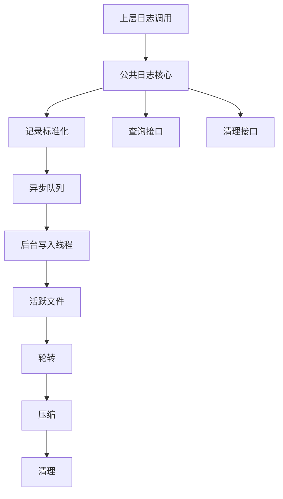

# 公共基础层详细设计

## 1. 修订记录

| 版本 | 日期 | 作者 | 说明 |
| --- | --- | --- | --- |
| v0.1 | 2026-06-19 | Codex | 从总设计中拆分公共基础层独立详细设计 |

## 2. 背景与目标

### 2.1 背景

公共基础层是日志系统的统一基础设施层，负责为上层日志能力提供一致的运行时支撑。

其职责不是表达业务语义，也不是描述原始数据内容，而是解决所有日志层都会遇到的共性问题：

1. 如何统一写入入口
2. 如何控制异步写入与刷新
3. 如何管理文件生命周期
4. 如何执行轮转、压缩、清理和恢复
5. 如何为查询和工具层提供基础能力

### 2.2 实现目标

公共基础层的实现目标如下：

1. 提供统一日志核心入口
2. 提供统一异步写入能力
3. 提供统一文件生命周期管理
4. 提供统一清理接口和查询接口
5. 为 `L1/L2/L3` 提供一致的底层基础设施

## 3. 需求概述

### 3.1 功能需求

1. 支持统一文件与目录命名规范
2. 支持统一文件生命周期管理
3. 支持按大小或时间窗口执行轮转
4. 支持后台压缩与压缩失败恢复
5. 支持按保留策略执行过期清理
6. 支持异常退出后的文件恢复与收尾
7. 支持查询接口和清理接口供工具层调用
8. 支持日志系统配置统一加载
9. 支持日志系统自身运行状态监控

### 3.2 非功能需求

1. 对业务线程影响尽量小
2. 文件结构清晰、便于人工检索
3. 异常场景下可降级、可恢复

## 4. 总体设计

### 4.1 模块定位

公共基础层的模块定位如下：

1. 提供日志核心和统一记录对象
2. 提供异步队列、线程池和刷新能力
3. 提供文件创建、轮转、压缩、清理、恢复能力
4. 提供查询与清理的公共接口

### 4.2 设计原则

1. 公共层只负责共性基础设施，不承担业务语义
2. 上层日志能力共享同一套生命周期规则
3. 文件管理、压缩、清理、恢复等动作只在公共层实现一次
4. 对外暴露统一接口，由工具层或各日志层调用

### 4.3 总体架构图



## 5. 模块划分

### 5.1 日志核心

职责：

1. 接收统一日志输入
2. 标准化记录对象
3. 选择输出目标

### 5.2 异步分发

职责：

1. 接收前台写入请求
2. 投递后台任务
3. 定时执行刷新

### 5.3 文件生命周期管理

职责：

1. 创建活跃文件
2. 轮转文件
3. 关闭后压缩
4. 清理过期文件
5. 恢复异常文件

### 5.4 工具接口层

职责：

1. 提供查询接口
2. 提供手动清理接口
3. 提供状态统计接口

## 6. 模块设计

### 6.1 日志核心设计

公共日志核心建议包含以下逻辑组件：

1. 模块元信息注册器
2. 日志记录校验器
3. 日志器注册表
4. 格式化选择器
5. 输出适配器
6. 日志统一入口

核心流程：

1. 接收日志输入
2. 构造统一记录对象
3. 补齐层级、模块、输出组等元信息
4. 投递异步写任务
5. 执行格式化和落盘

### 6.2 异步分发设计

1. 业务线程只负责提交写任务
2. 后台线程负责批量写入
3. 定时刷新组件周期性触发 `flush`
4. 队列满时按策略降级或丢弃低优先级日志

### 6.3 文件生命周期设计

#### 6.3.1 活跃文件

1. 创建活跃文件
2. 写入过程中仅保留开始时间
3. 关闭后补齐结束时间

#### 6.3.2 轮转策略

1. 按文件大小判断是否轮转
2. 轮转后新建活跃文件
3. 必要时保留上一文件尾部内容到新文件

#### 6.3.3 压缩策略

1. 关闭文件后进入压缩队列
2. 后台线程异步压缩
3. 压缩失败时保留原文件并输出内部错误

#### 6.3.4 清理策略

1. 按保留时间判断
2. 按总容量判断
3. 特殊时间异常文件可保留不删

#### 6.3.5 恢复策略

1. 启动时扫描未完成文件
2. 尝试补齐命名和收尾
3. 无法恢复时隔离异常文件并重建新文件

### 6.4 查询与清理接口设计

1. 支持按模块查询
2. 支持按级别查询
3. 支持按时间范围查询
4. 支持查询最新若干条热日志
5. 支持手动清理日志

## 7. 数据结构设计

### 7.1 日志记录

```cpp
struct LogRecord {
    std::string version;          // 格式版本
    int64_t timestamp_us;         // 业务事件时间
    int64_t receive_timestamp_us; // 接收时间
    std::string layer;            // 所属层级
    std::string module;           // 模块名
    LogLevel level;               // 日志级别
    std::string payload;          // 日志内容
};
```

### 7.2 公共配置

```cpp
struct CommonLogOptions {
    std::string root_dir;                  // 日志根目录
    LogLevel default_level;                // 默认日志级别
    size_t queue_size;                     // 队列容量
    size_t batch_size;                     // 批量写入条数
    int flush_interval_ms;                 // 刷新周期
    size_t max_file_size_bytes;            // 单文件大小上限
    int retention_days;                    // 保留天数
    size_t total_size_limit_bytes;         // 总容量上限
    size_t disk_warn_threshold_bytes;      // 磁盘告警阈值
    size_t disk_emergency_threshold_bytes; // 磁盘紧急阈值
};
```

## 8. 文件与目录设计

### 8.1 普通日志目录

```text
/var/log/robot/
├── <module_a>/
├── <module_b>/
└── system/
```

### 8.2 命名规则

1. 活跃文件保留开始时间
2. 关闭后补齐结束时间
3. 压缩文件增加 `.gz` 后缀

## 9. 结论

公共基础层是日志系统的统一底座。

其核心职责是：

1. 统一日志入口
2. 统一异步写入
3. 统一文件生命周期
4. 统一查询与清理接口
