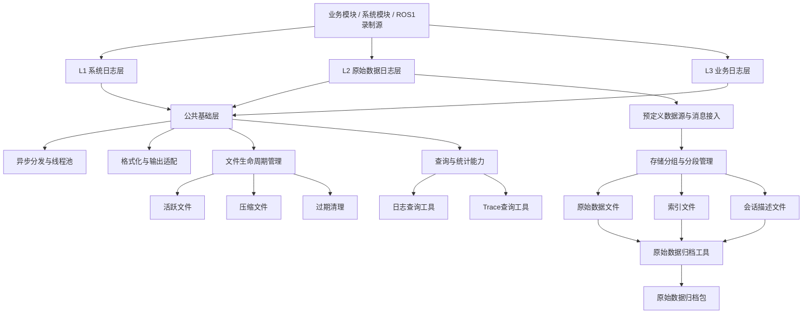
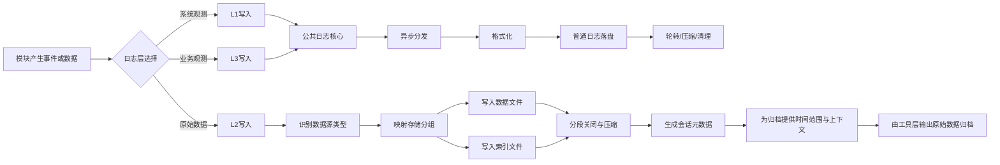

# 日志模块详细设计

## 1. 修订记录

| 版本 | 日期 | 作者 | 说明 |
| --- | --- | --- | --- |
| v0.1 | 2026-06-18 | Codex | 形成首版详细设计 |
| v0.2 | 2026-06-18 | Codex | 明确区分 L1 系统日志与 L3 业务日志定位 |
| v0.3 | 2026-06-18 | Codex | 补充日志模块需求来源与实现目标 |
| v0.4 | 2026-06-18 | Codex | 调整为实现前设计视角，去除具体代码文件引用 |
| v0.5 | 2026-06-19 | Codex | 基于现有 L2 实现反推原始数据日志架构，并抽象化具体命名 |
| v0.6 | 2026-06-19 | Codex | 调整公共层与 L2 层职责边界，并保留 L1/L3 整体结构 |

## 2. 背景与目标

### 2.1 背景

日志模块是机器人系统统一的观测与数据记录基础组件。设计上承载三类核心能力：

1. `L1` 系统日志  
   面向系统运行、平台状态、基础设施事件、守护进程和底层服务观测。

2. `L2` 原始数据日志  
   面向 ros topic、传感器数据等原始数据的结构化落盘、索引组织和离线分析支撑。

3. `L3` 业务日志  
   面向业务流程、任务状态、模块决策、场景事件等高层业务语义输出。

### 2.2 需求来源

该模块的需求来源主要不是单一功能需求，而是机器人系统在实际联调、现场运维、问题复盘和回放分析过程中逐步暴露出的共性诉求，主要包括：

1. 现场问题排查通常同时涉及系统状态、业务状态和原始 topic 数据，单一记录形式无法覆盖完整排障链路
2. 各模块如果各自输出日志或各自维护数据文件，格式、目录和时间语义难以统一
3. 回放分析平台需要稳定、标准化的输入数据包，不能依赖临时拼接文件或人工筛选目录
4. 长时间运行环境下，日志轮转、压缩、恢复和过期清理需要统一机制，否则容易出现磁盘膨胀、文件残留或数据缺失

因此，需要建设一个统一的日志模块，对系统日志、业务日志和原始数据日志进行分层治理，并对公共层与各层特有能力进行清晰拆分，对外提供一致的记录、查询、归档和清理能力。

### 2.3 实现目标

结合上述需求来源，日志模块的实现目标如下：

1. 建立统一的数据记录基础设施，降低各模块接入和维护成本
2. 明确分层职责，将系统日志、业务日志与原始数据日志清晰拆开
3. 统一文件组织、时间命名和索引方式，降低离线分析和人工检索复杂度
4. 建立稳定的 L1 系统日志能力，支撑系统运行状态、基础设施事件和底层异常观测
5. 建立稳定、标准化的 L2 原始数据日志能力，支撑离线分析工具输入、问题复盘和时间窗归档
6. 建立稳定的 L3 业务日志能力，支撑任务流程、场景状态、策略决策和业务事件分析
7. 支持长时间运行下的轮转、压缩、清理和异常恢复
8. 支持问题定位时按时间窗口快速导出原始数据归档

## 3. 需求概述

### 3.1 功能需求

#### 3.1.1 公共组件

1. 支持统一文件与目录命名规范
2. 支持统一文件生命周期管理
3. 支持按大小或时间窗口执行轮转
4. 支持后台压缩与压缩失败恢复
5. 支持按保留策略执行过期清理
6. 支持异常退出后的文件恢复与收尾

#### 3.1.2 L1 系统日志

1. 支持系统模块注册与级别控制
2. 支持记录进程、服务、基础组件、底层资源相关事件
3. 支持文本和 JSON 输出
4. 支持控制台和文件输出
5. 支持基于模块和时间范围查询

#### 3.1.3 L2 原始数据日志

1. 支持按预定义录制清单采集原始数据
2. 支持通用业务数据、静态数据和大数据分组存储
3. 支持原始载荷与索引双写
4. 支持导航、定位、控制等相关 topic 的统一落盘

#### 3.1.4 L3 业务日志

1. 支持业务模块注册与级别控制
2. 支持记录任务、流程、状态迁移、异常场景、业务事件
3. 支持带上下文和扩展字段的结构化输出
4. 支持按业务模块、trace、时间查询
5. 支持与 L2 原始数据日志协同定位问题

### 3.2 非功能需求

1. 写入过程对业务线程影响尽量小
2. 文件结构清晰、便于人工检索
3. 具备较强的异常恢复能力

## 4. 总体设计

### 4.1 总体分层

日志模块整体设计分为五层能力：

1. 公共基础层
2. 系统日志层
3. 原始数据日志层
4. 业务日志层
5. 工具入口层

职责关系如下：

1. 公共基础层提供日志核心、线程池、文件生命周期、查询基础能力
2. L1 基于公共基础层输出系统运行日志
3. L2 在公共基础层之上扩展原始数据日志、索引和归档基础能力
4. L3 基于公共基础层输出业务流程与业务语义日志
5. 工具入口层提供按时间窗口离线归档和手动清理等功能

### 4.2 L1/L2/L3 分层语义

#### 4.2.1 L1 定位

`L1` 注重系统层面观测，面向“系统怎么运行”的问题。

适用内容：

1. 进程启动、退出、重启
2. 配置加载、依赖初始化
3. 线程池、IO、通信、底层服务异常
4. 平台组件健康状态
5. 容器、设备、资源、守护组件运行信息

#### 4.2.2 L2 定位

`L2` 注重原始数据日志，面向“当时产生了什么数据”的问题。

适用内容：

1. 消息通道原始数据
2. 全局环境数据与局部环境数据
3. 导航相关 topic 输入输出
4. 机器人状态与控制指令
5. 离线问题复盘数据

#### 4.2.3 L3 定位

`L3` 注重业务层面观测，面向“业务为什么这样决策”的问题。

适用内容：

1. 任务开始、暂停、完成、失败
2. 场景状态迁移
3. 业务规则命中
4. 任务编排和策略决策
5. 对用户或上层系统可解释的事件

### 4.3 总体架构图



### 4.4 关键业务流程图

#### 4.4.1 日志与原始数据日志主流程



## 5. 模块划分

### 5.1 公共基础层

职责：

1. 提供统一日志核心抽象
2. 提供异步分发和定时 flush
3. 提供文件轮转、压缩、异常恢复和过期清理
4. 提供日志查询与统计

### 5.2 系统日志层

职责：

1. 复用公共层完成系统日志写入
2. 作为基础设施、平台组件、系统模块的日志出口

### 5.3 原始数据日志层

职责：

1. 维护预定义数据源清单、分组、分段、索引和会话元数据
2. 维护原始消息的统一接入与落盘
3. 提供会话元数据与归档支撑能力

### 5.4 业务日志层

职责：

1. 对外暴露业务日志接口
2. 复用公共层完成业务日志写入
3. 作为任务、流程、场景、业务事件的日志出口

### 5.5 工具入口层

说明：

当前文档不展开工具入口层的详细设计，仅保留边界说明，便于约束公共层与 L2 层的职责关系。

职责：

1. 提供日志查询工具
2. 提供 trace 查询工具
3. 提供原始数据时间窗归档工具
4. 提供日志清理工具

## 6. 模块设计

### 6.1 公共基础层设计

#### 6.1.1 日志核心

公共日志核心建议包含以下逻辑组件：

1. 模块元信息注册器
2. 日志记录校验器
3. 日志器注册表
4. 格式化选择器
5. 输出适配器
6. 日志统一入口

其核心流程为：

1. 注册模块元信息
2. 构造 `LogRecord`
3. 补齐层级、分类、输出组
4. 异步调度写任务
5. 格式化为文本或 JSON
6. 落盘并定时 flush

#### 6.1.2 异步分发

异步分发建议通过线程池与任务分发器实现：

1. 业务线程提交写任务
2. 后台线程异步执行格式化和写入
3. 定时刷新组件周期性触发 flush

#### 6.1.3 文件生命周期

文件生命周期建议由专门的文件管理组件负责：

1. 创建 active 文件
2. 根据大小判断轮转
3. active 文件在写入过程中仅保留开始时间，关闭后补齐结束时间并完成规范命名
4. 后台 gzip 压缩
5. 异常退出后扫描并恢复未完成收尾的文件
6. 基于文件名开始时间清理过期文件

清理规则：

1. 默认保留窗口 48 小时
2. 依据文件名上的开始时间判断
3. 若解析出年份为 `1970`，则不删除

时间语义说明：

1. 文件名上的 `开始时间-结束时间` 表示文件自身的创建时间范围
2. 文件内容中的时间以各条消息自身的 topic 时间戳为准
3. 进行问题定位或时间窗归档时，应优先依据消息时间和索引时间判定数据范围，不能仅依赖文件名时间

### 6.2 L1 模块设计

#### 6.2.1 模块目标

L1 面向系统层日志输出，强调运行基础设施可观测性。

#### 6.2.2 典型使用方

1. 进程管理模块
2. 启动脚本管理模块
3. 配置和参数加载模块
4. 底层通信、驱动、守护进程
5. 系统监控组件

#### 6.2.3 对外能力

1. 初始化日志层
2. 注册系统模块
3. 写入系统日志
4. 调整模块级别或全局级别
5. 主动刷新缓冲区
6. 关闭日志层并完成收尾

#### 6.2.4 输出特点

L1 的输出重点不是业务含义，而是：

1. 系统启动顺序是否正确
2. 资源、依赖、线程、服务是否正常
3. 基础能力是否出现异常或退化

### 6.3 L2 模块设计

#### 6.3.1 模块目标

L2 面向原始数据日志，强调数据可复盘、可索引、可离线分析。

#### 6.3.2 模块内容

1. 初始化记录会话与运行状态
2. 加载预定义录制数据源清单
3. 按统一规则接收并写入导航、定位、控制等相关 topic
4. 同时支持结构化消息和序列化消息落盘
5. 按采样模式控制写入频率
6. 维护分段、索引、会话元数据
7. 区分并分别处理高频大数据、业务数据和静态数据

#### 6.3.3 接入模型

L2 接入模型由两类对象构成：

1. 预定义数据源清单  
   描述需要录制的数据主题、数据类型、来源模块、来源域、来源子类以及分段阈值
2. 原始消息  
   描述消息时间、序号、帧标识、任务标识、载荷编码、原始载荷和摘要信息

这样设计的目的：

1. 将内置录制清单与运行时消息解耦
2. 支持结构化消息和序列化消息统一落盘
3. 为后续归档和离线分析提供稳定元信息

#### 6.3.4 存储分组策略

L2 会将数据源映射到不同的存储分组：

1. 通用业务数据组  
   用于大多数状态、控制和业务相关小的原始数据
2. 静态数据组  
   用于更新频率低、归档时需要优先保留的静态上下文数据
3. 大数据组  
   用于体量大、更新频率高或需要独立控制分段规模的数据

这样设计的目的：

1. 将大对象数据与高频常规数据隔离
2. 允许不同分组配置不同分段阈值和压缩策略
3. 便于工具层归档时对静态数据执行特殊补齐策略

#### 6.3.5 采样模式

L2 的采样模式设计如下：

1. 全量模式下所有消息实时写入
2. 普通模式下，存在活动任务时实时写入；无活动任务时按固定时间窗抽样
3. 低频模式下，统一按更长时间窗抽样
4. 每个数据源在抽样窗口内仅保留最近一条待写消息，窗口切换时再落盘
5. 抽样策略对所有预定义数据源统一生效

#### 6.3.6 记录格式

单条原始记录由三部分构成：

1. 二进制记录头  
   描述元信息长度、载荷长度、记录时间、消息时间、序号和记录编号
2. 元信息块  
   使用结构化文本描述会话、数据源、采样、任务态和摘要信息
3. 原始载荷块  
   保存结构化载荷或序列化后的原始消息

与之配套的索引文件至少需要记录以下信息：

1. 数据在原始文件中的偏移量
2. 记录时间和消息时间
3. 记录编号
4. 数据主题和数据类型
5. 采样模式和采样原因
6. 载荷大小和基础摘要信息

#### 6.3.7 分段策略

轮转、重命名和压缩本身由公共基础层的文件生命周期组件统一负责，L2 主要定义原始数据日志的分段策略：

1. L2 按存储分组维护独立分段，避免不同类型原始数据相互干扰
2. 每个数据源可以配置独立的分段阈值
3. 分段阈值既可以直接按数据源配置，也可以结合目标压缩体积做自适应估算
4. 为减少跨分段分析断点，新分段会继承上一分段尾部少量记录作为重叠数据
5. 关键大对象数据可以采用不同于普通业务数据的分段策略

#### 6.3.8 会话信息

异常恢复、补压缩和过期清理等动作由公共基础层统一负责，L2 在这一部分主要维护与原始数据日志相关的会话元数据：

1. L2 维护会话级描述文件和运行时状态
2. 会话级描述文件记录会话标识、环境信息、根目录、采样模式和起止时间

#### 6.3.9 归档支撑能力

L2 为工具层归档提供以下基础能力：

1. 通过索引文件重建分段时间范围
2. 通过稳定目录结构组织原始文件、索引文件和会话描述文件
3. 通过独立分组保留静态数据，便于工具层补齐上下文
4. 通过统一命名规则支持按时间窗口筛选分段
5. 通过会话级描述文件提供环境信息和采样信息

### 6.4 L3 模块设计

#### 6.4.1 模块目标

L3 面向业务层日志输出，强调流程、任务和业务语义可解释性。

#### 6.4.2 典型使用方

1. 导航任务编排模块
2. 状态机模块
3. 调度与任务管理模块
4. 场景识别与业务决策模块
5. 上层业务控制模块

#### 6.4.3 对外能力

1. 初始化日志层
2. 注册业务模块
3. 写入业务日志
4. 调整模块级别或全局级别
5. 主动刷新缓冲区
6. 关闭日志层并完成收尾

#### 6.4.4 输出特点

L3 关注的问题包括：

1. 当前执行的是哪一个业务任务
2. 任务为什么开始、暂停、结束、失败
3. 业务规则和策略为何命中
4. 哪些业务异常影响了用户可见结果

### 6.5 工具入口层设计

#### 6.5.1 日志查询工具

提供普通日志查询入口。

#### 6.5.2 Trace 查询工具

提供 trace 维度查询入口。

#### 6.5.3 原始数据时间窗归档工具

提供 L2 时间窗归档能力。

时间窗归档流程如下：

1. 解析归档时间范围
2. 扫描 L2 目录并读取索引，重建分段时间范围
3. 选取与目标时间窗重叠的分段
4. 额外补齐最近一份静态数据分段
5. 将选中的原始文件、索引文件和描述文件复制到临时归档目录
6. 生成归档描述文件
7. 输出压缩归档包

参数：

1. 根目录
2. 开始时间
3. 结束时间
4. 持续时长
5. 输出路径

#### 6.5.4 日志清理工具

提供统一日志清理入口。

规则：

1. 默认保留 48 小时
2. 按文件名开始时间删除
3. `1970` 年文件保留
4. 支持模拟执行
## 7. 数据结构设计

### 7.1 公共数据结构

#### 7.1.1 日志级别

统一对外日志级别定义。

#### 7.1.2 模块选项

模块注册时的扩展元信息：

1. 分类
2. 子类
3. 事件类型
4. 输出分组

#### 7.1.3 日志记录

公共日志内部记录对象，主要字段：

1. 时间戳
2. 模块标识
3. 输出分组
4. 级别
5. 日志消息
6. 分层元信息
7. 上下文
8. 扩展字段
9. 可选载荷

### 7.2 L2 数据结构

#### 7.2.1 数据源描述

```cpp
struct L2TopicDescriptor {
    std::string topic;                                  // 录制的 topic 名称
    std::string topic_type;                             // topic 对应的数据类型
    std::string source_module;                          // 产生该数据的模块
    L2SourceDomain source_domain;                       // 数据来源域，如传感器或算法
    std::string source_type;                            // 数据来源子类，用于进一步分类
    std::uint64_t segment_size_bytes;                   // 原始分段大小阈值
    std::uint64_t target_compressed_segment_size_bytes; // 目标压缩体积阈值
};
```

#### 7.2.2 记录会话配置

```cpp
struct L2RecorderOptions {
    LogLevel level;                         // 记录级别
    std::string root_dir;                   // L2 根目录
    std::string session_id;                 // 当前记录会话 ID
    std::string host;                       // 主机标识
    std::string container;                  // 容器或运行环境标识
    L2SampleMode sample_mode;               // 采样模式
    std::vector<L2TopicDescriptor> topics;  // 预定义录制数据源清单
};
```

#### 7.2.3 时间窗归档参数

```cpp
struct L2PackageOptions {
    std::string root_dir;   // 归档扫描根目录
    int64_t start_time_us;  // 归档时间窗开始时间
    int64_t end_time_us;    // 归档时间窗结束时间
    std::string output_path;// 归档输出路径
};
```

#### 7.2.4 原始消息

```cpp
struct L2TopicMessage {
    std::string topic;                               // 所属 topic
    int64_t message_time_us;                         // 消息时间戳，单位微秒
    std::string task_id;                             // 任务标识，当前实现中可为空
    std::string frame_id;                            // 坐标系或帧标识
    int64_t sequence;                                // 消息序号
    std::string payload_encoding;                    // 载荷编码方式，如 json / ros_serialized
    std::string payload;                             // 结构化载荷或展示用载荷
    std::string replay_payload;                      // 实际写盘的原始载荷
    std::map<std::string, std::string> payload_summary; // 载荷摘要信息
    std::string action_phase;                        // 动作阶段，当前实现默认是 topic
    std::string action_state;                        // 动作状态，当前实现可为空
};
```

#### 7.2.5 原始记录头

```cpp
struct ReplayBinaryRecordHeader {
    uint32_t metadata_size;   // 元信息 JSON 长度
    uint32_t payload_size;    // 原始载荷长度
    int64_t record_time_us;   // 实际写盘时间
    int64_t message_time_us;  // 消息自身时间
    int64_t sequence;         // 消息序号
    uint64_t record_id;       // 递增记录编号
};
```

#### 7.2.6 分段缓冲记录

```cpp
struct BufferedReplayRecord {
    ReplayBinaryRecordHeader header;   // 二进制记录头
    std::string metadata_json;         // 元信息 JSON
    std::string payload;               // 原始载荷
    std::string index_line_without_offset; // 尚未补齐 offset 的索引行
};
```

#### 7.2.7 数据源运行时状态

```cpp
struct TopicRuntime {
    L2TopicDescriptor descriptor;      // 数据源静态描述
    std::string module_name;           // 归属模块名
    std::string storage_bucket_name;   // 存储分组名
    std::string storage_group_path;    // 输出分组路径
    int64_t pending_second;            // 当前待刷新的采样窗口标识
    L2TopicMessage pending_message;    // 当前窗口保留的最新消息
    bool has_pending;                  // 是否存在待刷新消息
};
```

#### 7.2.8 存储分组运行时状态

```cpp
struct StorageRuntime {
    std::string bucket_name;                   // 存储分组名
    uint64_t segment_index;                    // 当前分段序号
    int64_t segment_start_message_time_us;     // 分段时间范围开始值
    int64_t segment_end_message_time_us;       // 分段时间范围结束值
    int64_t last_rename_time_bucket_us;        // 上次重命名时间桶
    std::filesystem::path data_path;           // 当前数据文件路径
    std::filesystem::path index_path;          // 当前索引文件路径
    std::ofstream data_stream;                 // 当前数据文件流
    std::ofstream index_stream;                // 当前索引文件流
    size_t current_data_size_bytes;            // 当前数据文件大小
    size_t current_index_size_bytes;           // 当前索引文件大小
    double estimated_compression_ratio;        // 历史压缩比估计
    uint64_t next_record_id;                   // 下一条记录编号
    std::deque<BufferedReplayRecord> recent_records; // 近期重叠记录缓存
    std::uint64_t segment_size_bytes;          // 原始分段阈值
    std::uint64_t target_compressed_segment_size_bytes; // 目标压缩体积阈值
};
```

#### 7.2.9 记录器全局状态

```cpp
struct RecorderState {
    L2RecorderOptions options;                           // 当前记录配置
    std::string session_id;                              // 当前会话 ID
    std::filesystem::path session_meta_path;             // 会话描述文件路径
    int64_t session_start_message_time_us;               // 会话开始时间
    int64_t session_end_message_time_us;                 // 会话结束时间
    int64_t session_meta_rename_time_bucket_us;          // 会话描述文件上次重命名时间桶
    std::string task_id;                                 // 当前任务 ID
    bool task_active;                                    // 当前任务是否活跃
    int64_t task_idle_deadline_us;                       // 任务空闲截止时间
    bool initialized;                                    // 记录器是否已初始化
    std::vector<std::filesystem::path> completed_files;  // 已完成文件集合
    std::unordered_map<std::string, TopicRuntime> topics;         // 数据源运行时表
    std::unordered_map<std::string, StorageRuntime> storage_buckets; // 存储分组运行时表
};
```

## 8. 文件与目录设计

### 8.1 普通日志文件

命名格式：

`[prefix_]YYYYMMDD_HHMMSS-YYYYMMDD_HHMMSS.log(.gz)`

适用于：

1. L1 系统日志
2. L3 业务日志

### 8.2 L2 原始数据目录

按照当前代码实现，L2 的目录分类如下：

```text
l2/
├── business_data/          # 业务数据目录
├── static_data/            # 静态数据目录
├── large_data/             # 大数据目录
│   └── local_map/          # local_map 这类大数据 topic 的独立目录
└── *.meta                  # 会话描述文件
```

其中分类规则为：

1. 静态数据 topic 写入 `static_data`
2. 大数据 topic 写入 `large_data/<topic_name>`
3. 其他预定义录制 topic 默认写入 `business_data`

### 8.3 清理规则

统一规则：

1. 按文件名开始时间判断
2. 超过 48 小时可删除
3. `1970` 年文件不删除

## 9. 后续建议

1. 为 L1 系统日志补充推荐模块清单和分类规范
2. 为 L3 业务日志补充业务事件命名规范
3. 为公共层补充统一命名规范和生命周期配置说明
4. 为 L2 原始数据格式增加正式规范说明
5. 将部分分组和归档规则配置化
6. 后续补充时序图和目录示意图

## 10. 结论

本设计将日志模块划分为较清晰的软件分层：

1. `L1` 负责系统级观测
2. `L2` 负责原始数据日志与归档基础能力
3. `L3` 负责业务级观测
4. 公共基础层提供统一基础设施
5. 工具入口层提供查询、归档、清理等运维与集成入口

其中：

1. `L1` 回答“系统运行是否正常”
2. `L2` 回答“当时的数据是什么”
3. `L3` 回答“业务为何这样执行”

这几层组合后，能够较完整支撑系统运行观测、问题复现与业务问题分析。
