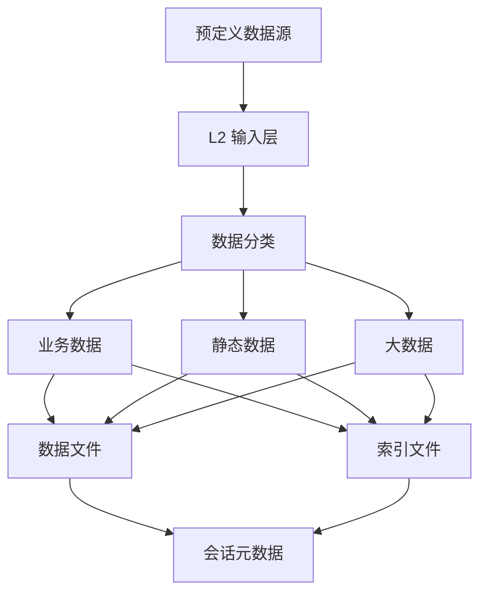

# L2 原始数据日志详细设计

## 1. 修订记录

| 版本 | 日期 | 作者 | 说明 |
| --- | --- | --- | --- |
| v0.1 | 2026-06-19 | Codex | 从总设计中拆分 L2 原始数据日志独立详细设计 |

## 2. 背景与目标

### 2.1 背景

`L2` 用于承载原始数据日志能力，重点面向离线分析、问题复盘和时间窗归档。

`L2` 本身不负责业务语义表达，也不负责工具层分析动作，而是负责：

1. 统一接入内置的预定义数据源
2. 将原始数据稳定落盘
3. 生成索引和会话元数据
4. 为归档和离线分析提供基础输入

### 2.2 实现目标

1. 支持按内置预定义清单采集原始数据
2. 支持结构化消息和序列化消息统一落盘
3. 支持业务数据、静态数据和大数据分组存储
4. 支持原始载荷、索引、会话信息统一组织
5. 为工具层归档提供稳定支撑能力

## 3. 需求概述

### 3.1 功能需求

1. 支持按内置录制清单采集原始数据
2. 支持原始载荷与索引双写
3. 支持导航、定位、控制等相关 topic 的统一落盘
4. 支持业务数据、静态数据和大数据分类存储
5. 支持采样模式控制写入频率
6. 支持维护分段、索引和会话元数据

### 3.2 非功能需求

1. 写入对业务线程影响尽量小
2. 目录结构稳定、便于归档
3. 支持长时间运行和异常恢复

## 4. 总体设计

### 4.1 模块定位

`L2` 的模块定位如下：

1. 接收内置预定义原始数据输入
2. 按分类规则组织存储目录
3. 按分段策略写入数据文件和索引文件
4. 维护会话级元数据
5. 为工具层归档提供基础输入

### 4.2 设计原则

1. `L2` 只负责原始数据记录，不承担回放逻辑
2. `L2` 只负责归档支撑，不负责归档动作本身
3. 公共层负责生命周期，`L2` 负责原始数据组织规则
4. 目录、文件、索引语义需稳定，便于后续工具解析

### 4.3 总体架构图



## 5. 模块划分

### 5.1 数据源接入层

职责：

1. 加载预定义数据源清单
2. 接收原始消息
3. 统一转换为内部记录对象

说明：

1. 当前实现不对外暴露动态 topic 注册接口
2. 外部仅通过 `LogL2::Start()` 启动录制
3. 实际录制 topic 集合由模块内部固定清单生成

### 5.2 数据分类层

职责：

1. 判断数据属于业务数据、静态数据或大数据
2. 生成稳定目录路径
3. 为不同类型数据选择分段策略

### 5.3 存储写入层

职责：

1. 写入原始数据文件
2. 写入索引文件
3. 维护分段状态

### 5.4 会话元数据层

职责：

1. 维护会话开始时间和结束时间
2. 维护会话描述文件
3. 为归档工具提供上下文信息

## 6. 模块设计

### 6.1 数据源接入设计

`L2` 接入模型由两类对象构成：

1. 预定义数据源清单
2. 原始消息

其中：

1. 数据源清单描述 topic、类型、来源模块、来源域、分段阈值等静态信息
2. 原始消息描述消息时间、序号、载荷内容等动态信息

### 6.2 数据分类设计

`L2` 会将数据映射到以下分组：

1. `business_data`
2. `static_data`
3. `large_data`

分类原则：

1. 普通业务相关原始数据进入 `business_data`
2. 静态上下文类数据进入 `static_data`
3. 高频大对象或大体量数据进入 `large_data`

其中大数据目录规则为：

1. `large_data/<topic_name>`
2. `topic_name` 取 topic 最后一段或等价稳定命名

### 6.3 采样模式设计

`L2` 支持以下采样模式：

1. 全量模式
2. 普通模式
3. 低频模式

采样原则：

1. 全量模式实时写入
2. 普通模式在任务活跃时全量写入，空闲时窗口抽样
3. 低频模式统一按更长窗口抽样

### 6.4 记录格式设计

单条原始记录由三部分组成：

1. 二进制记录头
2. 元信息块
3. 原始载荷块

索引文件至少记录：

1. 偏移量
2. 记录时间
3. 消息时间
4. 记录编号
5. 数据主题
6. 数据类型

### 6.5 分段策略设计

`L2` 主要定义原始数据日志的分段规则：

1. 按存储分组维护独立分段
2. 每个数据源可配置独立分段阈值
3. 支持结合目标压缩体积做自适应估算
4. 新分段可带少量重叠记录

### 6.6 会话信息设计

`L2` 维护以下会话信息：

1. 会话标识
2. 起止时间
3. 采样模式
4. 根目录
5. 环境信息

### 6.7 归档支撑设计

`L2` 为工具层提供以下支撑：

1. 通过索引文件重建时间范围
2. 通过稳定目录结构组织数据文件、索引文件和会话文件
3. 通过静态数据分组支持上下文补齐

## 7. 数据结构设计

### 7.1 数据源描述

```cpp
struct L2TopicDescriptor {
    std::string topic;                                  // topic 名称
    std::string topic_type;                             // topic 类型
    std::string source_module;                          // 来源模块
    L2SourceDomain source_domain;                       // 来源域
    std::string source_type;                            // 来源子类
    std::uint64_t segment_size_bytes;                   // 分段阈值
    std::uint64_t target_compressed_segment_size_bytes; // 目标压缩体积阈值
};
```

### 7.2 记录器配置

```cpp
struct L2RecorderOptions {
    std::string root_dir;                   // L2 根目录
    std::string session_id;                 // 会话 ID
    std::string host;                       // 主机标识
    std::string container;                  // 容器标识
    L2SampleMode sample_mode;               // 采样模式
    std::vector<L2TopicDescriptor> topics;  // 内部默认数据源清单占位
};
```

说明：

1. 当前实现中 `LogL2` 对外只保留 `Start()` 启动接口
2. `topics` 字段在结构体中保留，但启动时会被内部默认 topic 清单覆盖
3. `LogLevel` 已不再是当前 `L2` 配置项

### 7.3 原始消息

```cpp
struct L2TopicMessage {
    std::string topic;       // 所属 topic
    int64_t message_time_us; // 消息时间
    std::string frame_id;    // 帧标识
    int64_t sequence;        // 序号
    std::string payload;     // 业务载荷
    std::string replay_payload; // 实际写盘载荷
};
```

### 7.4 记录头

```cpp
struct ReplayBinaryRecordHeader {
    uint32_t metadata_size;   // 元信息长度
    uint32_t payload_size;    // 载荷长度
    int64_t record_time_us;   // 写盘时间
    int64_t message_time_us;  // 消息时间
    int64_t sequence;         // 序号
    uint64_t record_id;       // 记录编号
};
```

## 8. 文件与目录设计

### 8.1 L2 目录结构

```text
l2/
├── business_data/
├── static_data/
├── large_data/
│   └── local_map/
└── *.meta
```

### 8.2 分类规则

1. 静态数据 topic 写入 `static_data`
2. 大数据 topic 写入 `large_data/<topic_name>`
3. 其他预定义 topic 默认写入 `business_data`

### 8.3 时间语义

1. 文件名上的开始时间和结束时间表示文件自身的时间范围
2. 文件内容中的消息时间以 topic 自身时间戳为准
3. 索引和归档应优先依据记录时间与消息时间判断

## 9. 结论

`L2` 的核心职责是稳定记录原始数据并为离线工具提供输入。

其主要能力包括：

1. 预定义数据源接入
2. 分类存储
3. 原始数据与索引双写
4. 会话元数据维护
5. 归档支撑
