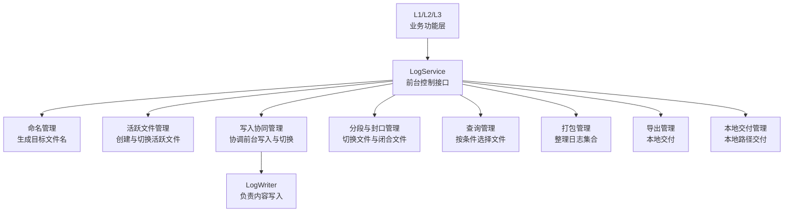

# LogService 模块详细设计

## 1. 修订记录

| 版本 | 日期 | 作者 | 说明 |
| --- | --- | --- | --- |
| v0.1 | 2026-06-19 | Codex | 新建 `LogService` 模块详细设计 |

## 2. 模块定位

`LogService` 是日志系统中的前台控制模块。

当前设计默认采用多进程部署隔离写入目标：不同日志层级或不同业务域若需要并发写入不同文件，应运行在不同进程中，并分别持有各自的 `LogService`/`LogWriter`/`LogManager` 实例。单个 `LogService` 实例只负责一个 `file_type` 的活跃文件控制与写入协同。

它不负责日志内容本身的落盘实现，也不负责后台扫描、压缩和清理，而是负责对外提供同步控制接口，统一管理日志文件的命名、创建、分段、封口、查询与交付动作。

职责边界上：

1. `LogWriter` 负责文本日志格式化、写入、刷新与基础轮转
2. `L2` 负责原始数据与索引文件写入
3. `LogService` 负责前台文件控制与对外交付接口
4. `LogAgent` 负责后台扫描、压缩、清理、异常恢复与统计治理
5. 并发写入不同目标文件的隔离边界按进程划分

## 3. 设计目标

1. 为 `L1/L2/L3` 提供统一的前台控制接口
2. 统一日志文件命名规则和活跃文件管理规则
3. 提供可控的分段、封口和切换能力
4. 提供查询、打包、导出、本地交付等对外服务能力
5. 与 `LogWriter`、`LogAgent` 解耦，保持职责清晰
6. 在多进程部署前提下支持不同日志层级并发写入不同文件

## 4. 总体设计

### 4.1 模块职责

`LogService` 负责以下几类能力：

1. 文件命名管理
2. 活跃文件创建管理
3. 写入协同管理
4. 分段控制管理
5. 封口管理
6. 查询管理
7. 打包管理
8. 导出管理
9. 本地交付管理

### 4.2 模块关系



多进程部署约束：

1. 同一进程内的 `LogService` 共享同一个 `LogManager` 写入运行时
2. 单个 `LogService` 实例只维护一个活跃文件会话
3. 同一进程内同一时刻只允许一个已激活写入目标
4. 若 `L1` 与 `L3` 需要并发写不同文件，应分别部署在不同进程
5. 进程之间通过文件目录约定和查询/打包接口协同，而不是共享 writer

接口约束：

1. `file_type` 只在创建活跃文件时传入，用于绑定当前 `LogService` 实例
2. 绑定完成后，写入、切段、封口、激活等操作默认作用于当前活跃文件
3. 单个 `LogService` 实例在首次成功创建活跃文件后即绑定到该 `file_type`
4. 绑定后的实例不能再切换到其他 `file_type`
5. 若需要控制其他 `file_type`，应创建新的 `LogService` 实例并在对应进程中使用

### 4.3 文件命名规则

`LogService` 负责统一生成日志文件名，命名语义如下：

1. 文件名由开始时间、结束时间和后缀组成
2. 文件命名使用系统时间，不使用消息体内部时间戳
3. 活跃文件只包含开始时间
4. 文件封口后补齐结束时间

示意形式如下：

```text
<start_time>-<end_time>.<suffix>
```

其中：

1. 活跃文件：`<start_time>-.<suffix>`
2. 已封口文件：`<start_time>-<end_time>.<suffix>`

### 4.4 对外接口清单

`LogService` 对外提供以下直接调用接口：

1. `CreateActiveFile()`：创建当前活跃文件并返回目标路径
2. `CreateActiveFileAndActivateWriter()`：创建活跃文件并同步激活写入目标
3. `WriteLog()`：向当前活跃文件写入日志
4. `SwitchSegment()`：对当前活跃文件执行分段切换并返回新的活跃文件路径
5. `SwitchSegmentAndActivateWriter()`：对当前活跃文件执行分段切换并同步激活新的写入目标
6. `SealFile()`：封口当前活跃文件
7. `ActivateWriter()`：将当前活跃文件交给 `LogWriter`
8. `QueryLogs()`：按条件查询日志文件集合
9. `PackageLogs()`：按条件生成日志包
10. `ExportPackage()`：将日志包导出到本地目标目录
11. `UploadPackage()`：将日志包交付到本地目标路径

接口返回形式建议如下：

1. `CreateActiveFile()`：同步返回文件路径
2. `CreateActiveFileAndActivateWriter()`：同步返回激活结果
3. `WriteLog()`：同步返回写入或缓冲结果
4. `SwitchSegment()`：同步返回新的活跃文件路径
5. `SwitchSegmentAndActivateWriter()`：同步返回切换与激活结果
6. `SealFile()`：同步返回封口结果
7. `ActivateWriter()`：同步返回激活结果
8. `QueryLogs()`：同步返回查询结果集
9. `PackageLogs()`：返回任务结果或 `task_id`
10. `ExportPackage()`：返回交付任务结果或 `task_id`
11. `UploadPackage()`：返回交付任务结果或 `task_id`

## 5. 模块划分

### 5.1 文件命名管理

职责：

1. 定义统一文件命名规则
2. 根据日志类型生成文件后缀
3. 生成活跃文件名与封口文件名
4. 保证文件名时间语义合法

### 5.2 活跃文件创建管理

职责：

1. 创建日志目录
2. 创建活跃文件
3. 记录当前正在写入的目标文件
4. 对外返回当前可写文件路径

### 5.3 写入协同管理

职责：

1. 对外接收日志写入请求
2. 将正常写入请求转交给 `LogWriter`
3. 在分段切换窗口内暂存新日志
4. 在切换完成后回放暂存日志
5. 保证切换前后写入语义连续

### 5.4 分段控制管理

职责：

1. 接收外部主动发起的分段请求
2. 触发活跃文件切换
3. 协调旧文件封口与新文件创建
4. 对外返回新的写入目标文件

### 5.5 封口管理

职责：

1. 将活跃文件转换为已封口文件
2. 补齐文件结束时间
3. 保证封口后文件不再被追加写入
4. 将封口结果标记为可供后续治理使用

### 5.6 查询管理

职责：

1. 接收按时间、模块、层级等条件的查询请求
2. 选择满足条件的日志文件集合
3. 对外返回文件结果或任务结果
4. 在必要时触发强制分段后再查询

### 5.7 打包管理

职责：

1. 按时间窗口、任务或事件收集文件
2. 生成日志归档集合
3. 输出打包描述信息
4. 为导出与本地交付提供输入

### 5.8 导出管理

职责：

1. 将打包结果导出到目标目录
2. 记录导出任务状态
3. 处理覆盖检查、路径校验和失败回滚

### 5.9 本地交付管理

职责：

1. 将打包结果交付到本地目标路径
2. 记录交付任务状态
3. 支持失败重试与结果说明

## 6. 模块设计

### 6.1 文件命名管理设计

设计流程：

1. 接收日志类型和当前系统时间
2. 生成活跃文件开始时间
3. 组合目录、文件名和后缀
4. 返回活跃文件路径

设计原则：

1. 命名规则必须统一
2. 文件名时间一律使用系统时间
3. 命名结果必须能被 `LogAgent` 正确识别

### 6.2 活跃文件创建管理设计

设计流程：

1. 接收创建请求
2. 创建目标目录
3. 创建活跃文件
4. 记录当前活跃文件状态
5. 对外返回当前可写文件路径
6. 在需要写入时由 `ActivateWriter()` 或 `CreateActiveFileAndActivateWriter()` 将目标文件路径交给 `LogWriter`

设计原则：

1. 活跃文件始终唯一
2. 活跃文件状态必须可追踪
3. 文件创建结果必须可被后续封口和恢复复用
4. 创建活跃文件本身不等于 writer 已激活
5. 若创建后激活 writer 失败，活跃文件仍然保留，调用方可后续重试激活或直接封口

### 6.3 写入协同管理设计

设计流程：

1. 接收前台写入请求
2. 判断目标文件是否处于正常写入状态
3. 正常状态下将日志直接交给 `LogWriter`
4. 分段切换窗口内将新日志写入短时缓冲区
5. 切换完成后将缓冲区中的日志按顺序写入新目标文件

设计要点：

1. `LogService` 负责前台写入协同，不直接替代 `LogWriter`
2. 写入协同的目标是保证切换窗口内日志不丢失
3. 缓冲区日志应保持原始到达顺序
4. 缓冲区处理结果应对调用方可感知
5. 写入前必须保证当前活跃文件对应的 writer 已成功激活

### 6.4 分段控制管理设计

设计流程：

1. 接收外部主动发起的分段请求
2. 将当前活跃文件置为切换中状态
3. 阻止新日志继续写入旧文件
4. 对切换窗口内的新日志进行有序过渡处理
5. 协调旧文件完成刷新与封口
6. 创建新的活跃文件并切换写入目标
7. 恢复正常写入

设计要点：

1. 分段属于前台同步控制动作
2. 分段动作应尽量短，避免阻塞写入
3. 分段应保证日志写入连续性，不允许因切换造成无感知丢失
4. 分段触发条件与封口时间均使用系统时间判定

缓冲区策略：

1. 切换窗口内使用短时缓冲区暂存新日志
2. 缓冲区容量支持配置上限
3. 缓冲区未达到上限时允许继续接收日志
4. 缓冲区达到上限后阻塞新的写入请求，直到切换完成
5. 不允许因缓冲区满而静默丢弃日志

切换握手规则：

1. 分段开始前先暂停旧文件的追加写入
2. `LogWriter` 先完成旧文件刷新
3. 旧文件封口完成后再生成新的活跃文件
4. 新目标文件交付给 `LogWriter` 后才允许恢复写入
5. 封口后的旧文件不得再被追加写入

并发控制规则：

1. 同一活跃文件的分段、封口、强制切段操作必须串行执行
2. 同一时刻只允许一个切换或封口动作生效
3. 查询命中活跃文件并触发强制切段时，应与普通分段请求互斥
4. 打包、导出、本地交付若依赖同一活跃文件，应先等待切段完成

### 6.5 封口管理设计

设计流程：

1. 接收封口请求
2. 读取活跃文件开始时间
3. 获取系统当前时间作为优先结束时间
4. 将活跃文件重命名为已封口文件
5. 将封口结果登记为待治理文件

设计原则：

1. 封口后的结束时间不得早于开始时间
2. 封口动作必须与活跃状态切换保持一致
3. 封口完成后应可立即被查询和打包识别

### 6.6 查询管理设计

设计目标：

1. 支持日志文件级查询
2. 支持按时间范围、模块、层级等条件查询
3. 支持在查询前检查活跃文件状态

设计流程：

1. 接收查询条件
2. 判断目标时间范围是否命中当前活跃文件
3. 若命中活跃文件，则先执行强制分段或强制切段续写
4. 从可用文件集中筛选目标文件
5. 返回匹配结果

设计要点：

1. 查询属于对外服务能力
2. 查询前应确保目标文件已封口
3. 对仍在写入的目标文件，应优先采用“切段并续写”的方式而不是单纯中断写入
4. 查询能力由 `LogService` 直接执行，无需经过其他模块
5. 当前实现中，查询默认扫描 `root_dir` 下全部日志目录；若只希望查询当前实例绑定的日志类型，应显式传入 `QueryCondition.file_type`

### 6.7 打包管理设计

设计流程：

1. 接收时间窗口、任务或事件条件
2. 查询目标文件集合
3. 若命中活跃文件，则先强制分段或强制切段续写
4. 将目标文件复制到临时目录
5. 生成打包描述文件
6. 输出归档结果与任务状态

设计要点：

1. 打包输入必须是已封口文件
2. 打包范围应可追溯
3. 打包动作应保留任务状态与失败原因
4. 对仍在写入的目标文件，应优先采用“切段并续写”的方式后再纳入打包
5. 打包由 `LogService` 直接执行，无需经过其他模块
6. 当前实现中，打包默认扫描 `root_dir` 下全部日志目录；若只希望打包当前实例绑定的日志类型，应显式传入 `QueryCondition.file_type`
7. 打包接口建议返回任务结果或 `task_id`

### 6.8 导出管理设计

设计流程：

1. 接收导出请求与导出目标目录
2. 获取打包结果
3. 校验目标目录与覆盖策略
4. 执行导出
5. 记录导出结果

设计要点：

1. 导出属于本地交付动作
2. 导出失败应支持回滚或明确失败标记
3. 导出结果应可追踪
4. 导出由 `LogService` 直接执行，无需经过其他模块
5. 导出接口建议返回任务结果或 `task_id`

### 6.9 本地交付管理设计

设计流程：

1. 接收交付请求与本地目标路径
2. 获取打包结果
3. 执行本地复制交付
4. 记录交付结果

设计要点：

1. 本地交付属于本地文件分发动作
2. 交付失败应支持有限次重试
3. 超过重试上限后应转为失败任务
4. 本地交付由 `LogService` 直接执行，无需经过其他模块
5. 交付接口建议返回任务结果或 `task_id`

### 6.10 当前实现约束

当前版本的 `LogService` 通过单进程内单实例 `LogWriter`/`LogManager` 承担文本日志写入，因此同一进程内同一时刻只支持一个已激活的写入目标。

约束如下：

1. 单个 `LogService` 实例只维护一个 `ActiveFileSession`
2. 同一进程内同一时刻只允许一个 `file_type` 挂接到 `LogWriter`
3. 若不同 `file_type` 需要并发写入，应拆分到不同进程部署
4. 若同一进程内需要切换到新的写入目标，必须先封口当前已激活目标或对其执行切段续写
5. `CreateActiveFileAndActivateWriter()` 若在激活阶段失败，不回滚已创建的活跃文件，而是保留当前会话供后续重试或封口
6. 查询或打包在仅给出时间窗口、模块名、级别等条件时，会对命中的活跃会话采取保守切段策略，确保结果只包含已封口文件

## 7. 数据结构设计

### 7.1 活跃文件状态对象

```cpp
struct ActiveFileSession {
    std::filesystem::path active_path; // 当前活跃文件路径
    std::string file_type;             // 文件类型
    std::string file_suffix;           // 文件后缀或文件格式标识
    int64_t start_time_us;             // 文件开始时间
    bool switching;                    // 当前是否处于分段切换状态
    size_t buffered_records;           // 切换窗口内暂存日志数量
};
```

### 7.2 服务策略对象

```cpp
struct LogServicePolicy {
    size_t switch_buffer_limit; // 分段切换缓冲区上限
    bool block_on_buffer_full;  // 缓冲区写满时是否阻塞
    size_t upload_retry_limit;  // 本地交付失败后的最大重试次数
};
```

### 7.3 查询条件对象

```cpp
struct QueryCondition {
    int64_t start_time_us;    // 查询开始时间
    int64_t end_time_us;      // 查询结束时间
    std::string file_type;    // 文件类型
    std::string module_name;  // 模块名
    std::string log_level;    // 日志级别
    std::string file_suffix;  // 文件后缀或文件格式筛选条件
};
```

### 7.4 打包任务对象

```cpp
struct PackageTask {
    std::string task_id;                    // 打包任务标识
    QueryCondition condition;               // 打包筛选条件
    std::filesystem::path output_path;      // 打包输出路径
    std::filesystem::path manifest_path;    // 打包描述文件路径
    std::string message;                    // 任务结果说明
    std::string task_state;                 // 任务状态
    std::vector<std::filesystem::path> source_files; // 原始文件集合信息
};
```

### 7.5 交付任务对象

```cpp
struct DeliveryTask {
    std::string task_id;               // 交付任务标识
    std::string task_type;             // 任务类型
    std::filesystem::path source_path; // 交付源路径
    std::filesystem::path target_path; // 交付目标路径
    std::string message;               // 任务结果说明
    std::string task_state;            // 任务状态
    size_t retry_count;                // 已执行重试次数
};
```

### 7.6 LogService 运行时状态

```cpp
struct LogServiceState {
    std::optional<ActiveFileSession> active_session; // 当前活跃文件状态
    LogServicePolicy policy;                        // 当前服务策略
    bool writer_activated;                          // 当前 writer 是否已激活
};
```

## 8. 设计边界说明

`LogService` 是前台控制模块，不是后台治理模块，也不是日志内容写入模块。

边界说明如下：

1. `LogWriter` 负责日志内容写入与刷新
2. `LogService` 负责文件命名、分段、封口、查询、打包、导出、本地交付
3. `LogAgent` 负责扫描、压缩、清理、异常恢复与统计
4. `LogService` 可选复用 `LogAgent` 的治理结果，但对外接口本身无需经过 `LogAgent`
5. 写入目标并发隔离依赖多进程部署，而不是同进程多 writer

## 9. 结论

`LogService` 的本质是日志系统中的前台控制与对外服务模块。

它需要统一承担以下能力：

1. 文件命名
2. 活跃文件创建
3. 写入协同
4. 分段控制
5. 封口管理
6. 查询管理
7. 打包管理
8. 导出管理
9. 本地交付管理

通过将这些能力统一收口到 `LogService`，日志系统可以形成清晰的前台控制层，并与 `LogWriter`、`LogAgent` 分别保持清晰边界。
